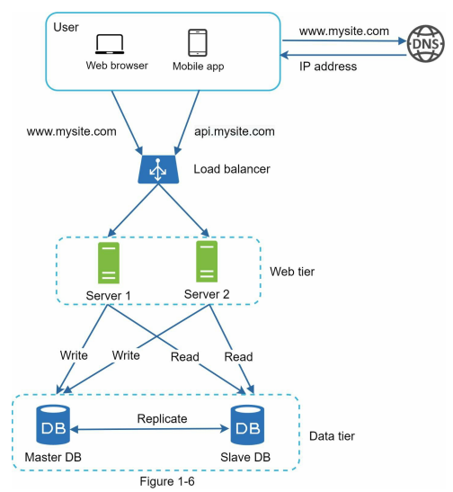

# 1장 사용자 수에 따른 규모 확장성
## 단일 서버
* 기본 처리 흐름
    - 
    - 도메인 이름 서비스(Domain Name Service, DNS)에 질의하여 IP 주소로 변환
    - 해당 IP 주소로 HTTP(HyperText Transfer Protocol) 요청 전달
    - 요청을 받은 웹 서버는 HTML 페이지나 JSON 형태의 응답을 반환환
## 데이터베이스
* 데이터베이스 분리
    - 웹/모바일 트래픽 처리 서버와 데이터베이스 서버 분리
    - 
* 데이터베이스 분류
    - 관계형 데이터베이스 관리 시스템(Relational Database Management System, RDBMS)
        - MySQL, 오라클, PostgreSQL 등
    - 비 관계형 데이터베이스(NoSQL)
        - 키-값 저장소(key-value store)
        - 그래프 저장소(graph store)
        - 칼럼 저장소(column store)
        - 문서 저장소(document store)
    - 선택 기준
        - 아주 낮은 응답 지연시간(latency) 요구
        - 비정형(unstructured) 데이터
        - 데이터(JSON, YAML, XML등)를 직렬화(serialize)하거나 역직렬화(deserialize) 할 수 있기만 하면 됨
        - 아주 많은 양의 데이터를 저장할 필요가 있음
## 수직적 규모 확장 vs 수평적 규모 확장
* 스케일 업(scale up)
    - 고사양 자원을 추가하는 행위
* 스케일 아웃(scale out)
    - 더 많은 서버를 추가하여 성능을 개선하는 행위
* 로드밸런서
    - 
    - 부하 분산 집합(lead balancing set)에 속한 웹 서버들에게 트래픽 부하를 고르게 분산하는 역할
    - DNS를 통해 웹서버 대신 로드밸런서의 공개 IP 주소로 접속
    - 서버 간 통신에는 사설 IP 주소가 이용
    - 다수의 웹서버 구축을 통해 장애를 자동복구하지 못하는 문제(no failover) 해소
    - 웹 계층의 가용성(availability) 향상
* 데이터베이스 다중화
    - 
    - 주(master)-부(slave) 관계 설정
        - 데이터 원본은 주서버에, 사본은 부 서버에 저장하는 방식
    - 주 데이터베이스에서만 쓰기 연산 담당
    - 부 데이터베이스는 주 데이터베이스부터 삽본을 전달받으며, 읽기 연산만을 지원
    - 대부분의 애플리케이션은 읽기 연산의 비중이 쓰기 연산보다 훨씬 높음
    - 
    - 이점
        - 더 나은 성능
            - 읽기 연산은 부 데이터베이스 서버들로 분산되어 병렬처리 가능
        - 안정성(reliability)
            - 데이터베이스 서버 가운데 일부가 파괴되어도 데이터는 보존
            - 지역적으로 떨어진 여러 장소에 다중화 시켜 놓을 수 있음
        - 가용성(availability)
            - 데이터를 여러 지역에 복제를 통해 문제가 발생해도 지속적인 서비스 가능
## 캐시
* 값비싼 연산 결과 또는 자주 참조되는 데이터를 메모리에 저장하고 같은 요청시 빨리 처리될 수 있도록 하는 저장소
* 캐시 계층
    - 데이터가 잠시 보관되는 곳
    - 데이터베이스보다 훨씬 빠름
    - 데이터베이스의 부하를 줄일 수 있음
    - 처리 과정
        - 캐시에 응답이 저장되어 잇는지 확인
        - -> 저장되어 있으면 해당 데이터를 클라이언트에 반환
        - -> 없는 경우, 데이터베이스 질의를 통해 데이터를 찾아 캐시에 저장한 뒤 클라이언트에 반환
* 캐시 사용 시 유의할 점
    - 데이터 갱신이 자주 일어나지 않고 참조는 빈번하게 일어나는 경우 고려
    - 캐시는 휘발성 메모리임을 염두
    - 만료 정책 고려
    - 일관성(consistency)을 위해 원본을 갱신하는 연산과 캐시를 갱신하는 연산은 단일 트랜잭션으로 처리되어야 함
    - 단일 장애 지점(Single Point of Failure, SPOF)을 피하기 위해 여러 지역에 걸쳐 캐시 서버 분산
        - SPOF : 어떤 특정 지점에서의 장애가 전체 시스템의 동작을 중담시켜버릴 수 있는 경우
    - 캐시 메모리가 너무 작으면 캐시에서 밀려나게됨(eviction), 과할당(overprovision)하여 갑자기 늘어나는 경우 대비 필요
    - 데이터 방출(eviction) 정책
        - LRU(Least Recently USed, 마지막으로 사용된 시점이 가장 오래된 데이터를 내보내는 정책)
        - LFU(Least Frequently Used, 사용된 빈도가 가장 낮은 데이터를 내보내는 정책)
        - FIFO(First In First Out, 가장 먼저 캐시에 들어온 데이터를 가장 먼저 내보내는 정책)
## 콘텐츠 전송 네트워크(CDN)
* 정적 콘텐츠 캐시(이미지, 비디오, CSS, JavaScript 등)
    - 
* 고려해야 할 사항
    - 자주 사용되는 컨텐츠 캐싱
        - 보통 3rd 사업자에 의해 운영, 데이터 전송 양에 따라 요금 청구
    - 적잘한 만료 시한 설정
    - CDN 장애에 대한 대처 방안 고려
    - 콘텐츠 무효화(invalidation) 방법
        - CDN 서비스 사업자가 제공하는 API를 이용
        - 코브젝트 버저닝(object versioning) 이용
            -  URL 마지막에 버전 번호를 인자로 추가
            - ex> image.png?v=2
## 무상태(stateless) 웹 계층
* 웹 계층을 수평적으로 확장
    - 상태 정보(사용자 세션 데이터 등)를 웹 계층에서 제거
        - 지속성 저장소에 보관하고 필요할 때마다 가져와서 사용
* 상태 정보 의존적인 아키텍처
    - 
    - 같은 클라이언트로부터의 요청은 항상 같은 서버로 전송되어야 함
        - 로드밸런서는 고정 세션(sticky session)이라는 기능을 제공하는데 로드밸런스에 부담
        - 서버 추가/제거 및 장애 처리도 복잡해짐
* 무상태 아키텍처
    - 
    - 상태 정보가 필요할 경우 공유 저장소(shared storage)로 부터 데이터를 가져옴
* 
## 데이터 센터
* 지리적 라우팅(geoDNS-routing, geo-routing)
    - 장애가 없는 상황에서 사용자와 가장 가까운 데이터 센터로 안내
    - 기술적 난제
        - 트래픽 우회: GeoDNS 활용
        - 데이터 동기화(synchronization)
            - 데이터 센터마다 별도의 데이터베이스 사용시 장애가 자동으로 복구되더라도 데이터를 찾을 수 없음
            - 데이터를 여러 데이터센터에 걸쳐 다중화
        - 테스트와 배포
            - 여러 위치에서 웹 사이트/애플리케이션 테스트 필요
            - 자동화된 배포 도구 활용
## 메시지 큐
* 메시지 큐
    - 메시지의 무손실(durability)을 지원하는 컴포넌트
    - 메시지의 버퍼 역할
    - 비동기적으로 전송
    - 생산자(producer/publisher) - 구독자(cosumer/subscriber) 구조
    - 
## 로그, 매트릭 그리고 자동화
* 로그
    - 단일 서비스로 모아주는 도구 활용
* 메트릭
    - 사업 현황에 관한 유용한 정보를 얻을 수 있음
    - 호스트 단위 메트릭: CPU, 메모리, 디스크 I/O에 관한 메트릭
    - 종합(aggregated) 메트릭: 데이터베이스 계층의 성능, 캐시 계층의 성능
    - 핵심 비지니스 메트릭: 일별 사용자(daily active user), 수익(revenue), 재방문(retention) 등
* 자동화
    - 빌드, 테스트, 배포 등의 절차 자동화
## 데이터베이스의 규모 확장
* 수평적 확장
    - 샤딩(sharding)
        - 
        - 대규모 데이터베이스를 샤드(shard)라고 부르는 작은 단위로 분할하는 기술
        - 모든 샤드는 같은 스키마를 쓰지만 샤드에 보관되는 데이터 사이에는 중복이 없음
* 고려사항
    - 샤딩 키(sharing key) = 파티션 키(partition key)
        - 데이터가 어떻게 분산될지 정하는 하나 이상의 컬럼으로 구성
        - 데이터를 고르게 분할 할 수 있도록 하는게 중요
* 복잡도
    - 데이터의 재 샤딩(resharding)
        - 데이터가 너무 많아져서 하나의 샤드로는 더 이상 감당하기 어려울때
        - 샤드 소진(shard exhaustion)
            - 샤드 간 데이터 분포가 균등하지 못하여 특정 샤드에 할단된 공간 소모가 다른 샤드에 비해 빨리 소비
    - 유명인사(celebrity) 문제
        - 핫스팟 키(hotspot key) 문제라고도 불림
        - 특정 샤드에 질의가 집중되어 서버에 과부하가 걸리는 문제
        - 유명인사 각각에 샤드 하나씩 할당하거나 더 잘게 쪼개어 저장
    - 조인과 비정규화(join and de-normalization)
        - 여러 샤드에 걸친 데이터 조인이 힘듬
        - 데이터베이스를 비정규화하여 하나의 테이블에서 질의가 수행될 수 있도록 변경
* 
## 백만 사용자, 그리고 그 이상
* 기법 정리
    - 웹 계층은 무상태 계층으로
    - 모든 계층에 다중화 도입
    - 가능한 한 많은 데이터를 캐시할 것
    - 여러 데이터 센터를 지원할 것
    - 정적 콘텐츠는 CDN을 통해 서비스할 것
    - 데이터 계층은 샤딩을 통해 그 규모를 확장할 것
    - 각 계층은 독립적 서비스로 분할할 것
    - 시스템을 지속적으로 모니터링하고, 자동화 도구들을 활용할 것