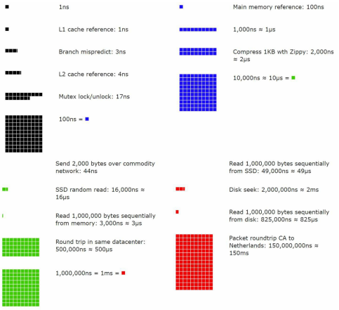

# 2장 개략적인 규모 추정
## 2의 제곱수
* 데이터 볼륨의 단위를 2의 제곱수로 표현
    - 최소 단위는 1바이트(8비트)
    - 
## 모든 프로그래머가 알아야 하는 응답지연 값
* 
* 
* 결론
    - 메모리는 빠르지만 디스크는 느림
    - 디스크 탐색(seek)은 가능한 한 피해야 함
    - 단순한 압축 알고리즘은 빠름
    - 데이터를 인터넷으로 전송하기 전에 압축
    - 데이터 센터는 여러 지역(region)에 분산되어 있고, 센터들간의 데이터 송수신에는 시간이 걸림
## 가용성에 관계된 수치들
* 고가용성(high availability)
    - 시스템이 오랜 시간 동안 지속적으로 중단 없이 운영될 수 있는 능력
    - 퍼센트로 표현
        - 100% : 한 번도 중단된 적 없음
## 예제: 트위터 QPS와 저장소 요구량 추정
* 가정
    - 월간 사용자는 3억명
    - 50%의 사용자가 트위터를 매일 사용
    - 각 사용자는 매일 2건의 트윗을 올림
    - 미디어를 포함하는 트윗은 10% 정도
    - 데이터는 5년간 보관
* 추정
    - QPS(Query Per Second) 추정치
        - 일간 사용자 = 3억 * 50% = 1.5억명
        - QPS = 1.5억 * 2트윗 / 24사간 / 3600초 = 3500
        * 최대 QPS(Peek QPS) = 2 * QPS = 7000
    - 미디어 저장을 위한 저장소 요구량
        - 평균 트윗 크기
            - tweet_id: 64 바이트
            - 텍스트: 140 바이트
            - 미디어: 1MB
        - 미디어 자장소 요구량 = 1.5억 * 2트윗 * 10% * 1MB = 30TB/일
        - 5년간 미디어를 보관하기 위한 저장소 = 30TB * 365* 5 = 55PB
## 팁
* 올바른 절차를밟느냐가 결과를 내는 것보다 중요
* 근사치 사용
* 가정(assumption)들을 적어 두기
* 단위(unit)를 붙여라
* QPS, 최대 QPS, 저장소 요구량, 캐시 요구량, 서버 수 등을 추정하는 문제 연습
