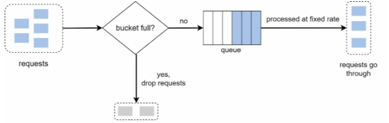

# 4장 처리율 제한 장치의 설계
* 처리율 제한 장치(rate limiter)
    - 클라이언트 또는 서비스가 보내는 트래픽의 처리율(rate)을 제어하기 위한 장치
    - DoS(Donial of Service) 공격에 의한 자원 고갈(resource starvation) 방지
    - 비용 절감
        - 서버 운영비 절감
        - third-party API 사용 비용 절감
    - 서버 과부화 막음
## 1단계 문제 이해 및 설계 범위 확정
* 면접관과 소통하며 처리율 제한 장치 알고리즘 선정
* 요구사항 예시
    - 설정된 처리율을 초과하는 요청은 정확하게 제한
    - 낮은 응답시간: 처리율 제한 장치는 HTTP 응답 시간에 나쁜 영향을 주면 안됨
    - 적은 메모리 사용
    - 분산형 처리율 제한: 하나의 처리율 제한 장치를 여러 서버나 프로세스에 공유
    - 예외 처리: 요청이 제한되었을 때는 그 사실을 사용자에게 분명하기 보여주기
    - 높은 결함 감내성(fault tolerance): 제한 장치에 장애가 생기더라도 전체 시스템에 영향을 주면 안됨
## 2단계 개략적 설계안 제시 및 동의 구하기
* 처리율 제한 장치는 어디에 둘 것인가?
    - 
    - 
    - 
* 처리율 제한 알고리즘
    - 토큰 버킷(token bucket)
    - 누출 버킷(leaky bucket)
    - 고정 윈도 카운터(fixed window counter)
    - 이동 윈도 로그(sliding window log)
    - 이동 윈도 카운터(sliding window counter)
* 토큰 버킷(token bucket)
    - 지정된 용량을 갖는 컨테이너
    - 동작 원리
        - 
        - 용량 4인 버킷, 토큰 공급기(refiller)가 매초 2개의 토큰 추가
        - 버킷이 가득차면 추가로 공급된 토큰은 버려짐(overflow)
        - 각 요청은 처리될때마다 하나의 토큰 소비
        - 처리과정
        - 
    - 토큰 버킷 알고리즘에 필요한 파라미터
        - 버킷 크기: 버킷에 담을 수 있는 토큰의 최대 개수
        - 토큰 공급률(refill rate): 초당 몇 개의 토큰이 버킷에 공급되는가
    - 버킷 사용 전략
        - API 엔드포인트마다 별도의 버킷 설정
        - IP 주소별로 처리율 제한 -> IP 주소마다 버킷 설정
        - 시스템의 처리율을 초당 10,000개 요청으로 제한 -> 요청이 하나의 버킷을 공유
    - 장점
        - 구현이 쉬움
        - 메모리 사용 효율적
        - 짧은 시간에 집중되는 트래픽(burst of traffic)도 처리 가능
    - 단점
        - 버킷 크기와 토큰 공급률 튜닝이 까다로움
* 누출 버킷(leaky bucket)
    - 토큰 버킷과 비슷, 요청 처리율 고정
    - FIFO 큐로 구현
    - 동작 원리
        - 큐에 새 요청 추가
        - 큐가 가득 차 있는 경우 새 요청은 버림
        - 지정된 시간마다 큐에 요청을 꺼내어 처리
        - 
    - 누출 버킷 알고리즘에 필요한 파라미터
        - 버킷 크기: 큐 사이즈
        - 처리율(outflow rate): 지정된 시간당 몇 개의 항목을 처리할지 지정하는 값
    - 장점
        - 큐의 크기가 제한되어 있어 메모리 사용량 효율적
        - 안정적 출력(stable outflow rate)
    - 단점
        - 단시간에 많은 트래픽이 몰리는 경우 최신 요청들은 버려지게 됨
        - 버킷 크기와 처리율 튜닝이 까다로움
* 고정 윈도 카운터(fixed window counter)
    - 동작 원리
        - 타임라인(timeline)을 고정된 간격의 윈도(window)로 나누고, 각 윈도마다 카운터(counter)를 붙임
        - 요청이 접수될 때마다 이 카운터의 값 1씩 증가
        - 이 카운터의 값이 임계치(threshold)에 도달하면 새로운 요청은 새 윈도가 열릴때까지 버려짐
        - 
    - 장점
        - 메모리 효율이 좋음
        - 이해하기 쉬움
        - 윈도가 닫히는 시점에 카운터를 초기화 하는 방식은 특정한 트래픽 패턴을 처리하기 적합함
            - 정기적인 호출
            - 최대 요청량을 엄격하게 제한해야 하는 경우
    - 단점
        - 윈도 경계 부근에서 일시적으로 많은 트래픽이 몰려드는 경우, 기대했던 한도보다 더 많은 양의 요청을 처리
        - 
    - 토큰 버킷과 비슷한거 아닌가요?
* 이동 윈도 로그(sliding window log)
    - 동작 원리
        - 요청의 타임스탬프 추적
            레디스의 정렬 집합 같은 캐시에 보관
        - 새 요청이 오면 만료된 타임스탬프(윈도 시작시점보다 오래된 타임스탬프) 제거
        - 새 요청의 타임스탬프를 로그(log)에 추가
        - 로그의 크기가 허용치보다 크면 처리 거부
        - 
    - 장점
        - 어느 순간의 윈도를 보더라도, 시스템의 처리율 한도를 넘기지 않음
    - 단점
        - 거부된 요청의 타임스탬프도 보관해야 하므로 다량의 메모리 사용
    - DDos가 발생한다면 서비스 이용 불가인가요?
* 이동 윈도 카운터(sliding window counter)
    - 고정 윈도 카운터 알고리즘과 이동 윈도 로깅 알고리즘 결합
    - 동작원리
        - 
        - 예시) 분단 7개 요청 처리로 설정
        - 현재 1분의 30% 시점에 새 요청이 도착한 경우
            - 현재 1분간의 요청 수 + 직전 분간의 요청 수 * 이동 윈도와 직전 1분이 겹치는 비율
            - 3 + 5 * 70% = 6.5개
    - 장점
        - 이전 시간대의 평균 처리율에 따라 현재 윈도의 상태 계산
        - 짧은 시간에 몰리는 트래픽에도 잘 대응
    - 단점
        - 직전 시간대에 도착한 요청이 균등하게 분포되어 있다고 가정한 상태에서 추정치를 계산하기 때문에 다소 느슨함
* 개략적인 아키첵처
    - 카운터 추적 대상 선정
        - 사용자별
        - IP 별
        - API 엔드포인트
        - 서비스 단위
    - 카운터의 저장 위치
        - 레디스 활용
            - INCR: 메모리에 저장된 카운터의 값 1증가
            - EXPIRE: 카운터의 타임아웃 값 설정
    - 동작 원리
        - 
## 3단계 상세 설계
* 개략적인 아키텍처에서 빠진 사항
    - 처리율 제한 규칙은 어떻게 관리되는가?
    - 처리가 제한된 요청들은 어떻게 처리되는가?
* 처리율 제한 규칙
    - 일반적으로 설정 파일 형태로 디스크에 저장
    - 예시
    ```
    domain: messaging
    descriptors:
        - key: message_type
          value: marketing
          rate_limit:
            unit: day
            requests_per_unit: 5
    ```
* 처리율 한도 초과 트래픽의 처리
    - HTTP 429(too many requests)를 클라이언트에게 보냄
    - 처리율 제한 장치가 사용하는 HTTP 헤더
        - X-Ratelimit-Remaining: 윈도 내에 남은 처리 가능 요청 수
        - X-Ratelimit-Limit: 매 윈도마다 클라이언트가 전송할 수 있는 요청 수
        - X-Ratelimit-Retry-After: 한도 제한에 걸리지 않으려면 몇 초 뒤에 요청을 다시 보내야 하는지 알림
* 상세 설계
    - 
* 분산 환경에서의 처리율 제한 장치 구현
    - 경쟁 조건(race condition)
        - 락(lock): 성능 하락 유발
        - 루아 스크립트(Lua script)
            - 레디스에서 루아 스크립트는 단일 트랜잭션으로 실행됨
        - 레디스 자료구조 활용 - 정렬 집합(sorted set)
    - 동기화(synchronization)
        - 
* 성능 최적화
    - 사용자의 트래픽을 가장 가까운 에지 서버로 전달
    - 제한 장치 간에 데이터를 동기화할 때 최종 일관성 모델(eventual consistency model) 사용
        - 6장 키-값 저장소 설계 참고
* 모니터링
    - 채택된 처리율 제한 알고리즘이 효과적인가?
    - 정의한 처리율 제한 규칙이 효과적인가?
## 4단계 마무리
* 알고리즘 이외에 검토하면 좋은 것들
    - 경성(hard)/연성(soft) 처리율 제한
    - 다양한 계층에서의 처리율 제한
        - Iptables 사용을 통한 IP 주소(OSI 3계층)에 처리율 제한
    - 처리율 제한을 회피하는 방법
        - 클라이언트 측 캐시를 사용하여 API 호출 횟수 줄임
        - 짧은 시간 동안 너무 많은 메시지를 보내지 않도록 함
        - 예외적 상황으로부터 우아하게(gracefully) 복구될 수 있도록 함
        - 재시도 로직을 구현할 때는 충분한 백오프(back-off) 시간 두기

