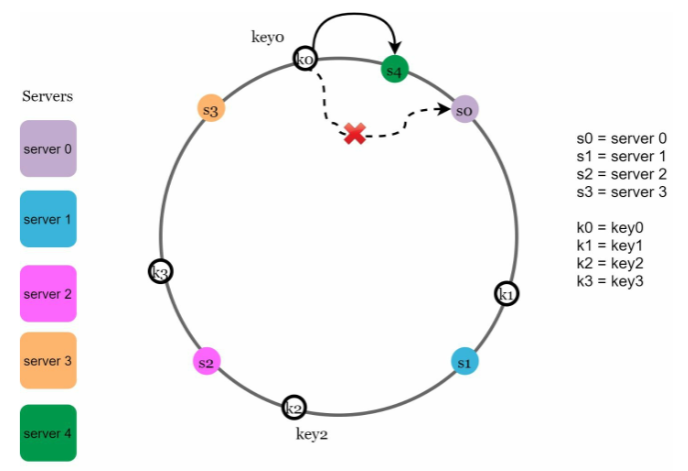

# 5장 안정 해시 설계
* 수평적 규모 확장성을 달성하기 위해서는 요청 또는 데이터를 균등하게 나누는 것이 중요
## 해시 키 재배치(rehash) 문제
* 문제 정의
    - N개의 서버가 존재한다고 했을때 데이터를 어디에 저장할 것인가?
* N개의 캐시 서버에 안정적으로 키를 분배하는 방법
    - 키는 데이터를 식별할 수 있는 값
    - serverIndex = hash(key) % N
    - 
    - 
* 서버가 추가되거나 기존 서버가 삭제된 경우(server1번이 죽은 경우 가정)
    - 해시값이 고정인 상태로 N만 변경됨
    - 
    - 대부분의 키가 재분배됨
    - 서버 한대가 죽음으로써 대규모 캐시미스 상태가 발생함
    - 이 문제를 효과적으로 해결하는 기술을 안정 해시(Consistent Hashing)라고 함
## 안정 해시
* 해시 테이블 크기가 조정 될 때 평균적으로 오직 k/n개의 키만 재배치하는 해시 기술
    - k 키의 개수
    - n 슬롯의 개수
* 해시 공간과 해시 링
    - 
    - 
* 해시 서버
    - 
* 해시 키
    - 
* 서버 조회
    - 키는 해당 키의 위치로부터 시계 방향으로 링을 탐색하나가면서 만나는 첫 번째 서버에 저장
    - 
* 서버 추가
    - 서버를 추가해도 일부 키만 재배치
    - 
* 서버 제거
    - 서버가 제거되면 일부 키만 재배치
    - 
* 기본 구현법의 두가지 문제
    - 서버가 추가 되거나 삭제되는 상황에서 파티션의 크기를 균등하게 유지하는게 불가능
        - 
    - 키의 균등 분포를 달성하기 어려움
        - 
* 가상 노드
    - 하나의 서버는 링 위에 여러개의 가성 노드를 가질 수 있음
    - 가상 노드 100~200개 설정시
        표준편차 5%~10%
    - 
* 재배치할 키 결정
    - 
    - 
# 마치며
    - 서버가 추가되거나 삭제될 때 재배치되는 키의 수가 최소화됨
    - 데이터가 보다 균등하게 분포되므로 수평적 규모 확장성을 달성하기 쉬움
    - 핫스팟 키 문제를 줄임(특정한 샤드에 대한 접근이 지나치게 빈번하지 않게 해줌)