# 6장 키-값 저장소 설계
* 키-값 저장소(key-value store)
    - 비 관계형(non-relational) 데이터베이스
    - 저장되는 값은 고유 식별자(identifier)를 키로 가져야 함
    - 키는 짧을수록 좋음
    - e.g. 아마존 다이나모, memcached, 레디스 등
## 문제 이해 및 설계 범위 확정
* 설계 범위 설정
    - 키-값 쌍의 크기는 10KB 이하
    - 큰 데이터 저장
    - 높은 가용성 제공
    - 높은 규모 확장성을 제공
    - 데이터 일관성 수준은 조정 가능해야 함
    - 응답 지연시간(latency)이 짧아야 함
## 단일 서버 키-값 저장소
* 모든 데이터를 메모리 안에 두는 것은 불가능
    - 대응책1. 데이터 압축
    - 대응책2. 자주 쓰이는 데이터만 메모리에 두고 나머지는 디스크에 저장
* 문제점
    - 어느 시점에는 확장이 필요함 -> 분산 키-값 저장소(distributed key-value store) 필요
## 분산 키-값 저장소
* CAP 정리(Consistency, Consistency, Partition Tolerance theorem)
    - 세 가지 요구사항을 동시에 만족하는 분산 시스템을 설계하는 것은 불가능
    - 데이터 일관성(Consistency)
        - 모든 클라이언트는 언제나 같은 데이터를 보게 되어야 함
    - 가용성(Consistency)
        - 일부 노드에 장애가 발생하더라도 항상 응답을 받을 수 있어야 함
    - 파티션 감내(Partition Tolerance)
        - 파티션: 두 노드 사이에 통신 장애가 발생한 것을 의미
        - 파티션 감내: 네트워크에 파티션이 생기더라도 시스템이 계속 동작해야 함
* CAP 정리를 기반으로한 분류
    - 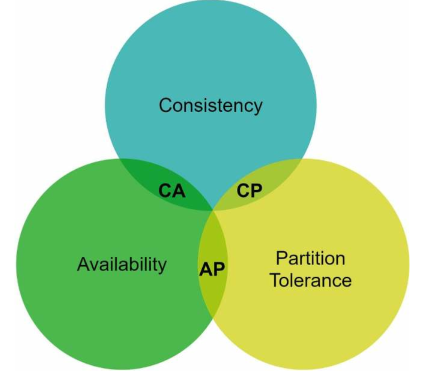
    - 네트워크 장애가 발생했을 때 어떻게 대응할 것인가!!!
    - CP 시스템
        - 일관성과 파티션 감내를 지원하는 키-값 저장소
        - 일관성 유지, 가용성 희생
        - 장애가 발생하면 문제 해결 전까지 write 연산 불가
        - e.g. MongoDB
    - AP 시스템
        - 가용성과 파티션 감내를 지원하는 키-값 저장소
        - 가용성 유지, 일관성 희생
        - 장애가 발생하더라도 write 가능
        - 예전 데이터를 줄 수 있음
        - 문제가 해결되면 노드간 동기화
        - e.g. Cassandra
    - CA 시스템
        - 파티션 감내를 감안하여 설계해야 하므로 존재하지 않음
* 시스템 컴포넌트
    - 데이터 파티션
    - 데이터 다중화(replication)
    - 일관성
    - 일관성 불일치 해소
    - 장애 처리
    - 시스템 아키텍처 다이어그램
    - 쓰기 경로
    - 읽기 경로
* 데이터 파티션
    - 데이터를 작은 파티션들로 분할
        - 특정 기준(날짜, ID, 해시값 등)으로 파티션 나눔
    - 분할 기준
        - 데이터를 여러 서버에 고르게 분산할 수 있는가
        - 노드가 추가되거나 삭제될 때 데이터의 이동을 최소화할 수 있는가
    - 안정 해시를 활용한 데이터 파티션
        - 규모 확장 자동화
        - 다양성(heterogeneity, 이기종성)
            - 서버들의 성능이나 용량이 서로 다를 때, 각 서버에 가상노드를 비례적으로 할당
            - 성능에 맞게 규형있는 분산 가능
        - 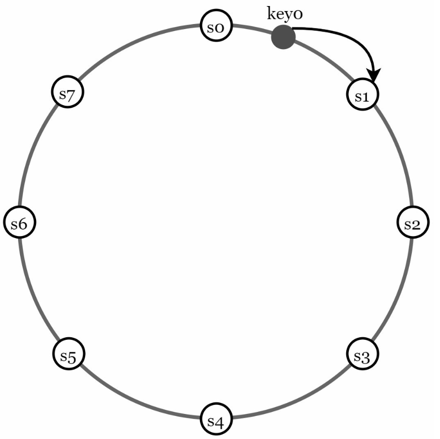
* 데이터 다중화
    - N개 서버에 비동기적으로 다중화(replication)
    - 시계방향으로 순회하면서 만나는 첫 N개 서버에 데이터 사본 저장
    - 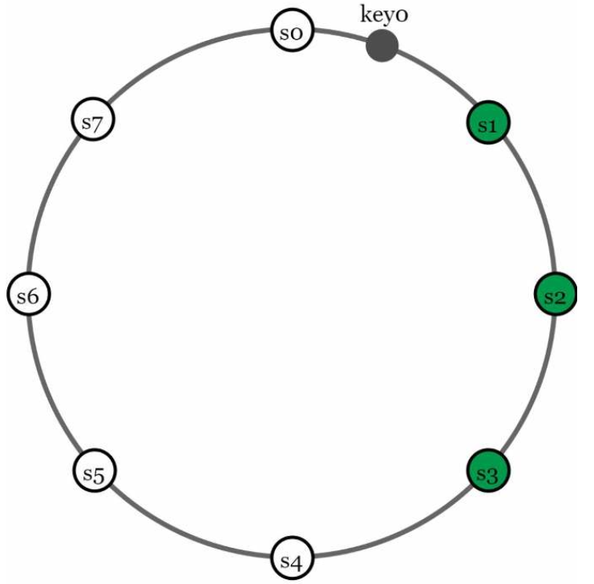
* 데이터 일관성
    - 여러 노드에 다중화된 데이터는 적절히 동기화 되어야 함
    - 정족수 합의(Quorum Consensus) 프로토콜
        - N = 시본 개수
        - W = 쓰기 연산에 대한 정족수, W개의 서버로부터 쓰기 연산 성공했다는 응답 받아야 함
        - R = 읽기 연산에 대한 정족수, R개의 서버로부터 읽기 연산 성공했다는 응답 받아야 함
        - 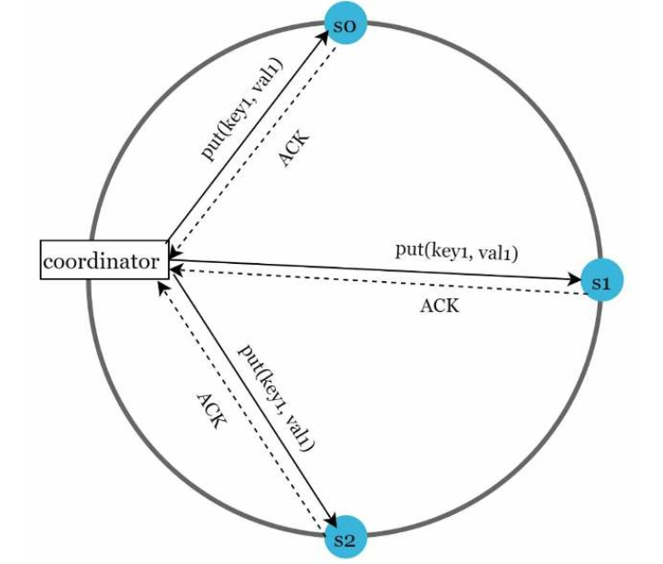
        - R=1, W=N: 빠른 읽기 연산에 최적화된 시스템
        - W=1, R=N: 빠른 쓰기 연산에 최적화된 시스템
        - W + R > N: 강한 일관성 보장(N=3, W=R=2)
        - W + R <= N: 강한 일관성을 보장하지 못함
* 일관성 모델(consistency model)
    - 강한 일관성(strong consistency)
        - 모든 읽기 연산은 가장 최근에 갱신된 결과 반환
        - 고가용성 시스템에는 적합하지 않음
    - 약한 일관성(weak consistency)
        - 읽기 연산은 가장 최근에 갱신된 결과를 반환하지 못 할수 있음
    - 결과적 일관성(eventual consistency)
        - 약한 일관성의 한 형태
        - 갱신 결과가 모든 사본에 반영되는 모델
        - 쓰기 연산이 병렬적으로 발생하면 시스템에 저장된 값의 일관성이 깨질 수 있음
* 비 일관성 해소 기법: 데이터 버저닝
    - 데이터 다중화를 하면 가용성은 높아지지만 일관성은 깨질 수 있음
    - 버저닝(versioning)과 벡터 시계(vector clock)는 그 문제를 해소하기 위해 등장한 기술
    - 버저닝
        - 데이터를 변경할 때마다 해당 데이터의 새로운 버전을 만듬
        - 각 버전의 데이터는 변경 불가능(immutable)
    - 벡터 시계
        - [서버, 버전]의 순서쌍을 데이터 추가할 것
        - D([S1, v1], [S2,v2], ..., [Sn, vn]) 으로 표현
    - 문제 상황
        - 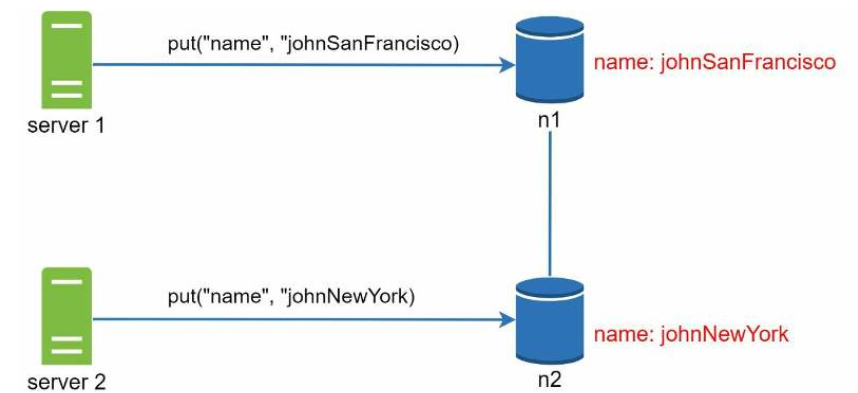
    - 벡터 시계를 이용하여 충돌 해결
        - 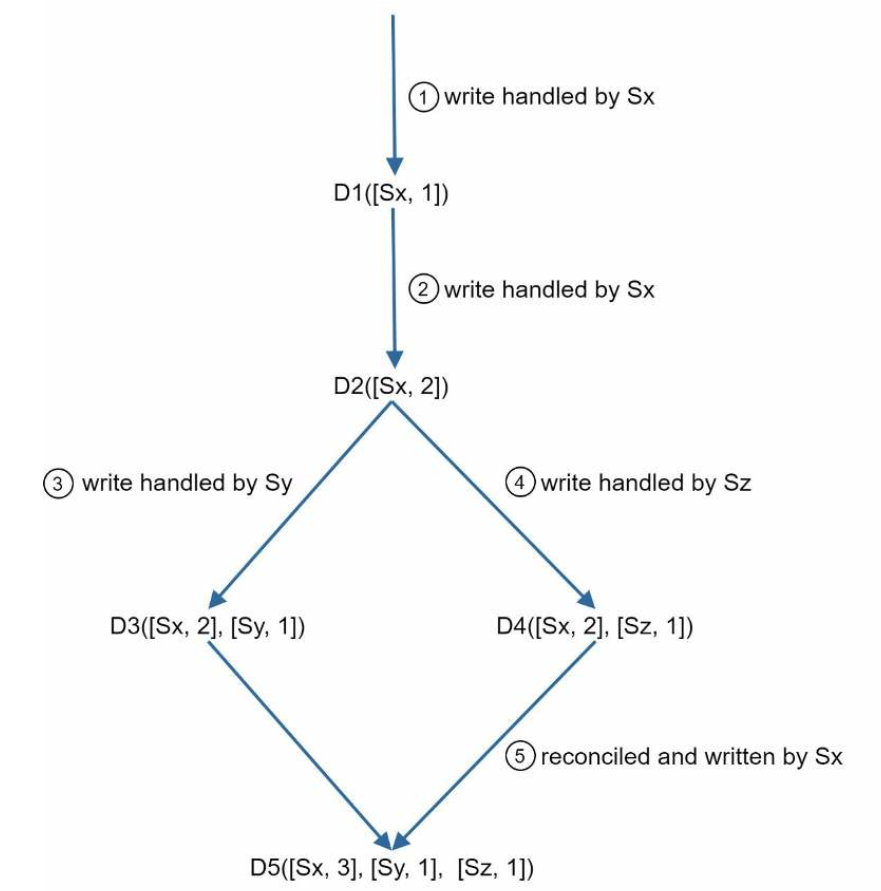
        - 클라이언트가 문제 상황 인지후 문제를 해결하여 서버에 기록
            - 오류 데이터를 클라이언트가 어떻게 받아 볼 수 있을까에 대한 토론 결과
                - R 정족수 통과의 결과를 활용
    - 벡터 시계의 단점
        - 충돌 감지 및 해소 로직이 클라이언트에 구현되므로 구현이 복잡해짐
        - [서버: 버전]의 순서쌍 개수가 빨리 늘어남(임계치를 설정하여 오래된 항목 제거)
* 장애 감지
    - 두 대 이상의 서버가 똑같이 서버 A의 장애를 보고해야 장애가 발생했다고 간주
    - 멀티캐스팅(multicasting) 채널 구축
        - 서버가 많을 때 비효율적
        - 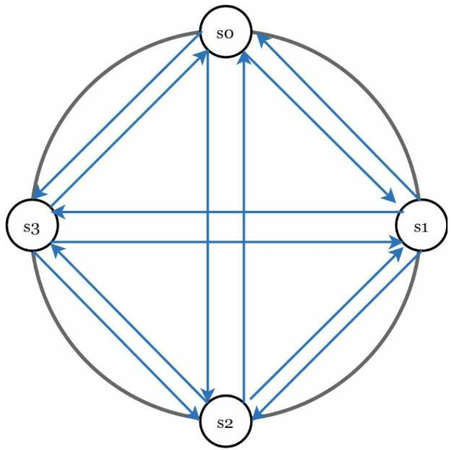
    - 가십 프로토콜(gossip protocol)
        - 분산형 장애 감지(decentralized failure detection) 솔루션 채택
        - 멤버십 목록 유지(멤버 ID, 박동 카운터 쌍)
        - 각 노드는 주기적으로 자신의 박동 카운터를 증가
        - 각 노드는 무작위로 선정된 노드들에게 주기적으로 자기 박동 카운터 목록 전송
        - 박동 카운터 목록을 받은 노드는 멤버십 목록을 최신 값으로 갱신
        - 어떤 멤버의 박동 카운터 값이 지정된 시간 동안 갱신되지 않으면 해당 멤버는 장애 상태로 간주
        - 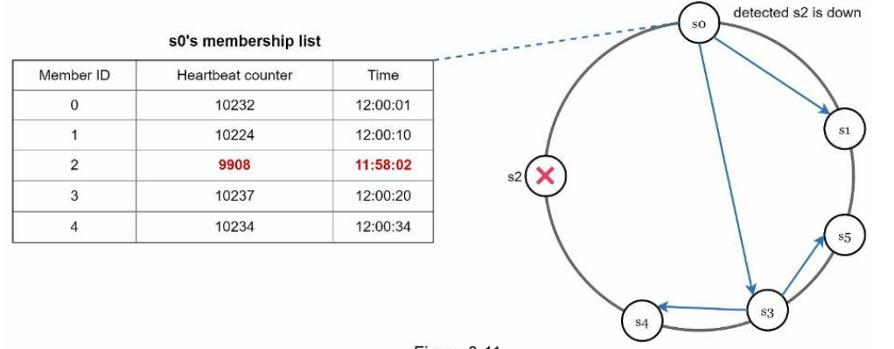
* 일시적 장애 처리
    - 가용성 확보를 위해 느슨한 정족수(sloppy quorum) 접근법
        - 쓰기 연산을 수행할 W개의 건강한 서버와 읽기 연산을 수행할 R개의 건강한 서버를 해시 링에서 선택
        - 장애 상태인 서버로 가는 요청은 다른 서버가 잠시 맡아 처리
        - 변경사항은 임시로 쓰기 연산을 처리한 서버에 단서(hint)를 남겨둠
        - 변경된 변경사항은 서버가 복구되었을 때 일괄 반영하여 데이터 일관성 보존
* 영구 장애 처리
    - 반-엔트로피(anti-entropy) 프로토콜
        - 사본들을 비교하여 최신 버전으로 갱신하는 과정
        - 머클(Merkle) 트리 사용
            - 동기화해야 하는 데이터의 양은 실제로 존재하는 차이의 크기에 비례(데이터 총량과 무관)
        - 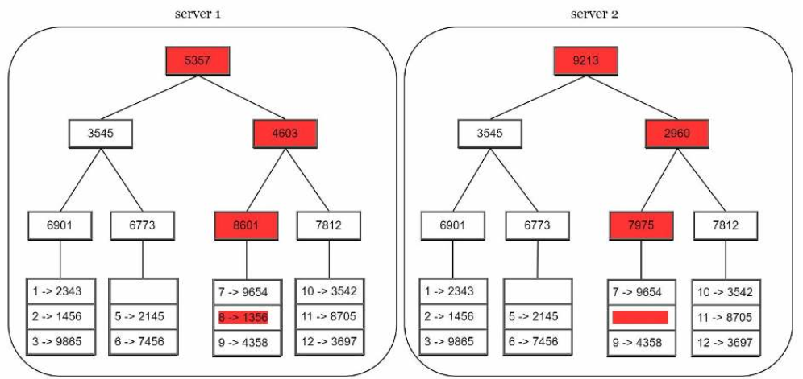
* 시스템 아키텍처 다이어그램
    - 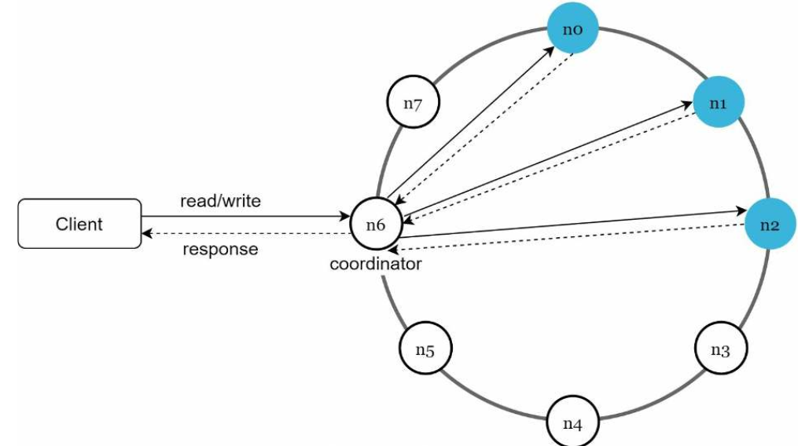
    - 클리이언트는 키-값 저장소가 제공하는 두 가지 단순한 API(get/set)와 통신
    - 중재자는 클라이언트에게 키-값 저장소에 대한 프락시 역할을 하는 노드
    - 노드는 안정해시의 해시 링 위에 분포
    - 노드를 자동으로 추가 또는 삭제할 수 있도록 분산(decentralized)
    - 데이터는 여러 노드에 다중화
    - 모든 노드가 같은 책임을 짐
        - SPOF(Single Point of Failure) 는 존재하지 않음
    - 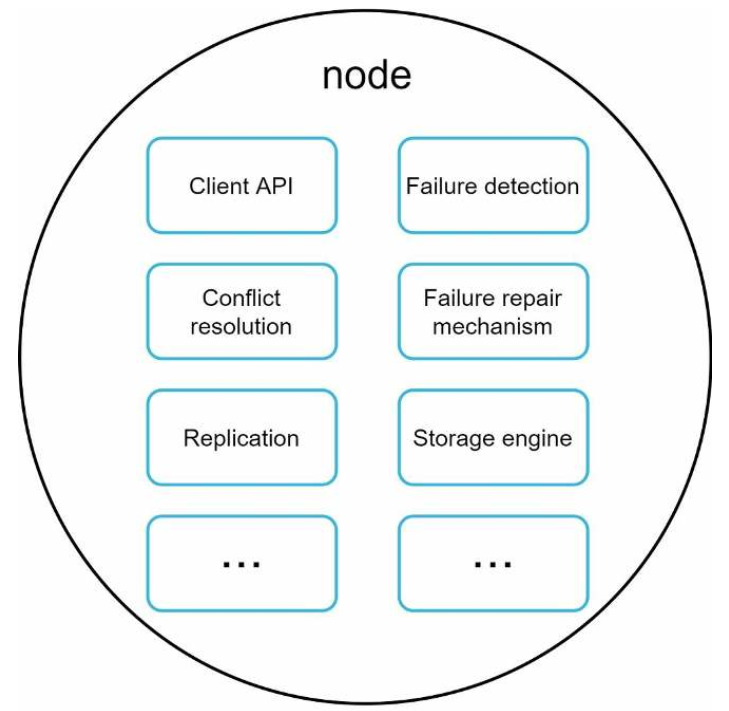
* 쓰기 경로
    - 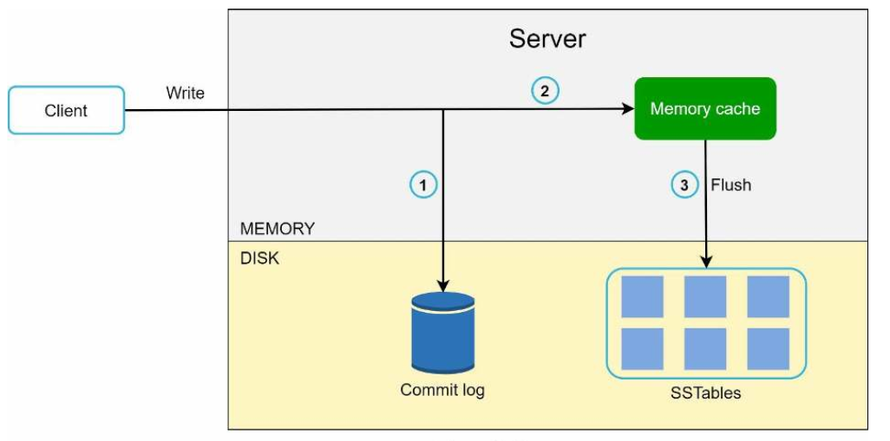
    - SSTable(Sorted-String Table)에 기록
* 읽기 경로
    - 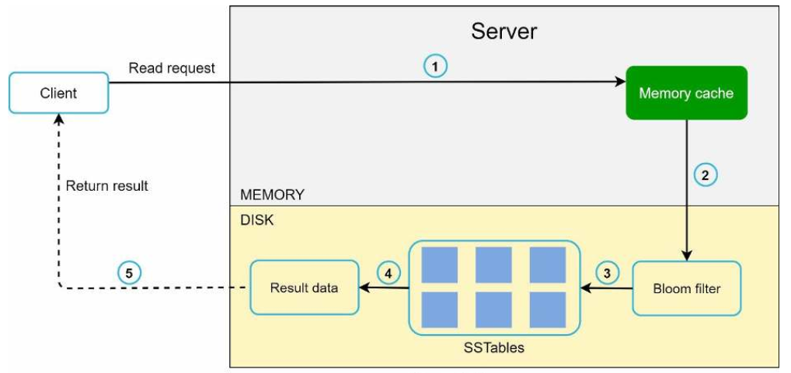
    - 캐시에 없는 경우 SSTable에서 가져옴
        - SSTable에 찾는 키가 있는지 알아내는 효율적임 방법으로 블룸 필터(Bloom filter) 사용
## 요약
| 목표 / 문제점                         | 기술 방식                                                       |
|------------------------------------|----------------------------------------------------------------|
| 대용량 데이터 저장                     | 안정 해시를 이용해 서버 간 부하 분산                      |
| 고가용성 읽기                         | 데이터 복제 다중 데이터 센터 구성                                |
| 고가용성 쓰기                         | 버저닝(Versioning)과 벡터 시계(Vector Clocks)를 통한 충돌 해결          |
| 데이터셋 분할                         | 안정 해시                                              |
| 점진적인 확장성                      | 안정 해시                                             |
| 이기종 환경(Heterogeneity)           | 안정 해시                                              |
| 조절 가능한 일관성                    | 정족수 합의(Quorum Consensus)                          |
| 일시적 장애 처리                     | 느슨한 정족수 프로토콜(Sloppy Quorum 및 Hinted Handoff)  |
| 영구적 장애 처리                     | 머클 트리(Merkle Tree)                                      |
| 데이터 센터 장애 처리                | 데이터 센터 간 복제 (Cross-data center replication)             |
