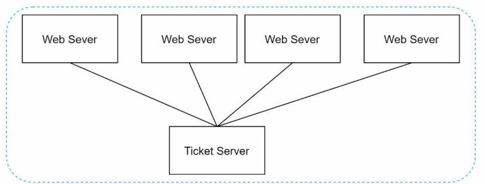
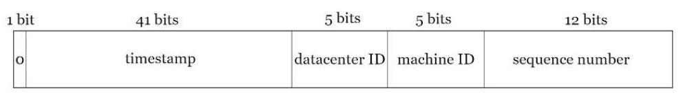

# 7장 분산 시스템을 위한 유일 ID 생성기 설계

## 1단계 문제 이해 및 설계 범위 확정

* 면접관가의 질의를 통해 도출한 요구사항
    - ID는 유일해야 함
    - ID는 숫자로만 구성
    - ID는 64비트로 표현될 수 있는 값
    - ID는 발급 날짜에 따라 정렬 가능해야 함
    - 초당 10,000개의 ID를 만들 수 있어야 함

## 2단계 개략적 설계안 제시 및 동의 구하기

* 선택지
    - 다중 마스터 복제
    - UUID
    - 티켓 서버
    - 트위터 스노플레이크 접근법
* 다중 마스터 복제
    - 데이터베이스의 auto_increment 기능 활용
    - 다음 ID를 구할때 k(데이터베이스 서버의 개수)만큼 증가
    - 단점
        - 시간 흐름에 맞추어 커지도록 보장 힘듬
        - 서버를 추가하거나 삭제할 때 동작보장하기 힘듬(k값 변화 시켜야함)
* UUID
    - 128비트 수
    - 충돌 가능성 낮음
    - 장점
        - 단순
        - 규모 확장 쉬움
    - 단점
        - 128비트로 김
        - 시간순 정렬 못함
        - 숫자가 아닌 값이 포함되어 있음
* 티켓 서버
    - 
    - 장점
        - 유일성 보장
        - 구현 쉬움
    - 단점
        - 티켓 서버가 SPOF(Single-Point-of-Failure)가 됨
* 트위터 스노플레이크 접근법
    - 각개격파 전략
    - 
    - 사인 비트: 1비트
    - 타임스탬프: 41비트 할당
    - 데이터센터 ID: 5비트
    - 서버 ID: 5비트
    - 일련번호: 12비트
        - 각 서버에서 ID 생성할때마다 일려번호 1 증가
        - 1ms가 경과할 때마다 0으로 초기화
