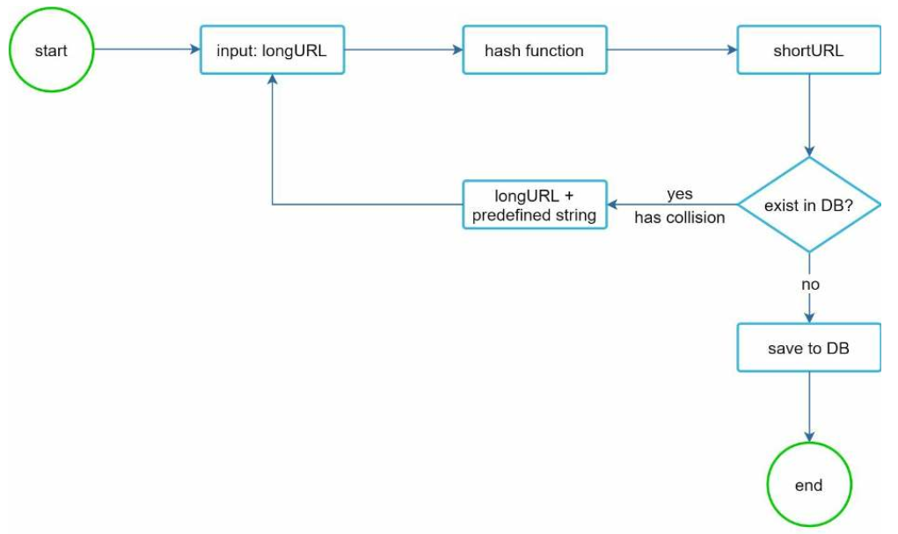

# 8장 URL 단축키 설계
## 1단계 문제 이해 및 설계 범위 확정
* 면접관가의 질의를 통해 도출한 추정치
    - 쓰기 연산: 매일 1억개의 단축 URL 생성
    - 초당 쓰기 연산: 1억/24/3600 = 1160
    - 읽기 연산: 10:1 비율로 가정하면 11,600회
    - URL 단축 서비스를 10년간 운영한다고 가정하면 1억*365*10 = 3650억개
    - 필요한 저장 용량 3650억*100바이트=36.5TB
## 2단계 개략적 설계안 제시 및 동의 구하기
* API 엔드포인트
    - URL 단축용 엔드포인트
        ```
        POST /api/v1/data/shorten
        * 인자: [longUrl: longURLstring]
        * 반환: 단축 URL
        ```
    - URL 리디렉션용 엔드포인트
        ```
        GET /api/v1/shortUrl
        * 반환: HTTP 리디렉션(원래 URL)
        ```
* URL 리디렉션
    - 301 PErmanently Moved
        - 영구적으로 Location 헤더에 반환된 URL로 이전
        - 브라우저 캐시 이용
    - 302 Found
        - 단축 URL 항상 호출되어야 함
* URL 단축
    - 요구사항
        - 입력으로 주어지는 긴 URL이 다른 값이면 해시 값도 달라야 함
        - 개산된 해시 값은 원래 입력으로 주어졌던 긴 URL로 복원 가능해야 함
## 3단계 상세 설계
* 해시 함수
    - 해시 값: [0-9, a-z, A-Z], 62개
    - 해시 값 길이
        - 3650억 개의 URL을 만들어 내야함
        - n=7이면 3.5조(62^7) 개의 URL을 만들 수 있음
    - 사용기술
        - 해시 후 충돌 해소
        - base-62 변환
* 해시 후 충돌 해소
    - 해시 함수 - CRC32, MD5, SHA-1
        | 해시 함수   | 해시 값 (16진수)                                                  |
        |-------------|------------------------------------------------------------------|
        | CRC32       | 5cb54054                                                         |
        | MD5         | 5a62509a84df9ee03fe1230b9df8b84e                                 |
        | SHA-1       | 0eeae7916c06853901d9ccbefbfcaf4de57ed85b                         |
    - 해시 길이로 정한 7보다 김
        - 
        - 단축 URL을 생성할 때 한 번 이상 데이터베이스 질의를 해야 하므로 오버헤드가 큼
        - 데이터베이스 대신 블룸 필터를 사용하면 성능을 높일 수 있음
* base-62 변환
    - 고유한 ID를 62진법을 이용하여 변환
* 비교
    | 해시 + 충돌 해결                          | Base 62 변환 방식                                                |
    |----------------------------------------|-----------------------------------------------------------------|
    | 짧은 URL의 길이가 고정됨                     | 짧은 URL의 길이가 고정되지 않으며, ID가 커질수록 길어짐                   |
    | 고유한 ID 생성기가 필요하지 않음              | 고유한 ID 생성기에 의존함                                          |
    | 충돌이 발생할 수 있으며 해결이 필요함          | ID가 고유하므로 충돌이 발생하지 않음                                 |
    | ID에 기반하지 않기 때문에 다음 URL을 예측할 수 없음 | ID가 1씩 증가하면 다음 짧은 URL을 쉽게 예측할 수 있어 보안에 취약할 수 있음 |
