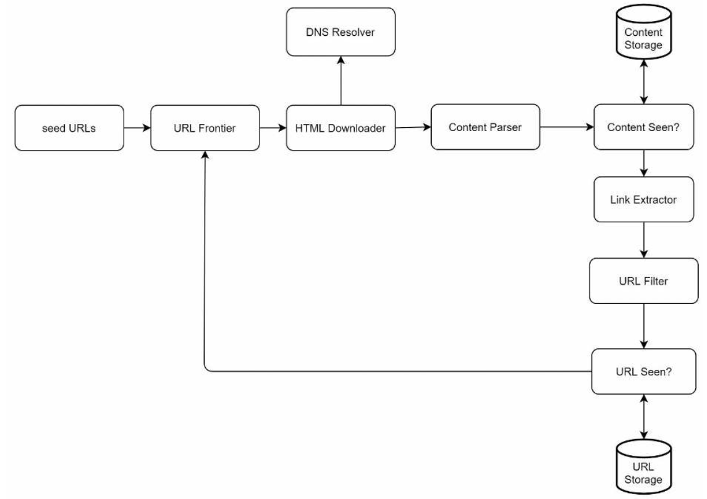
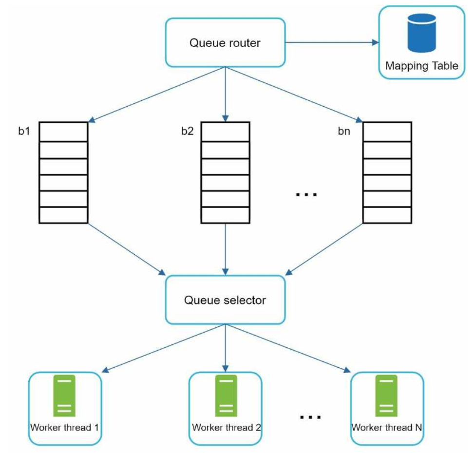
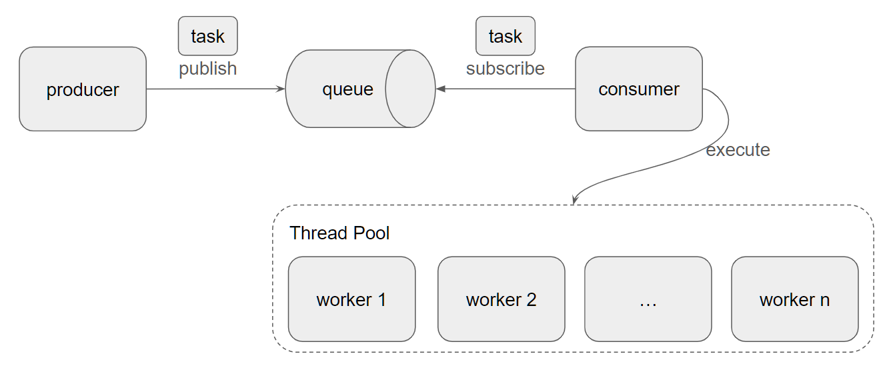
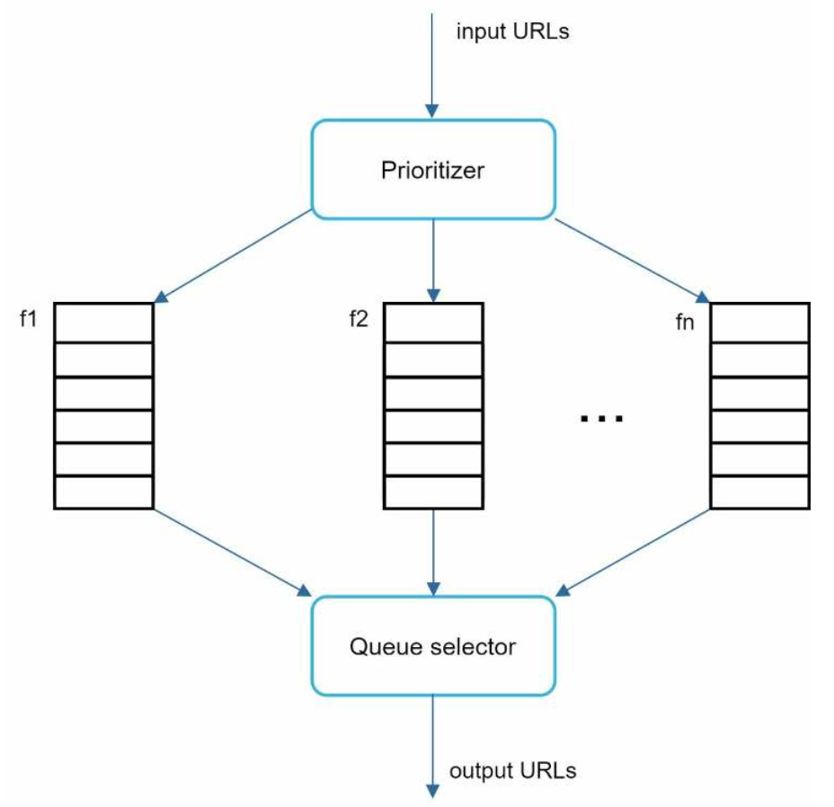
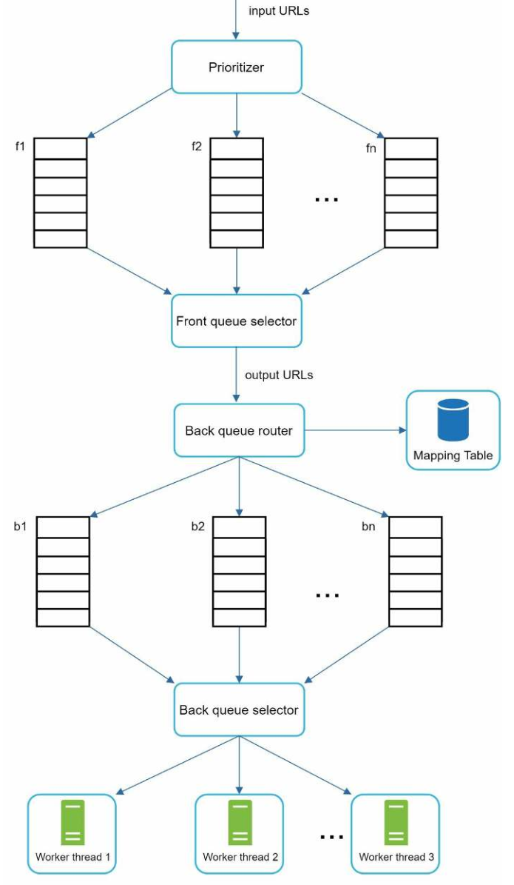
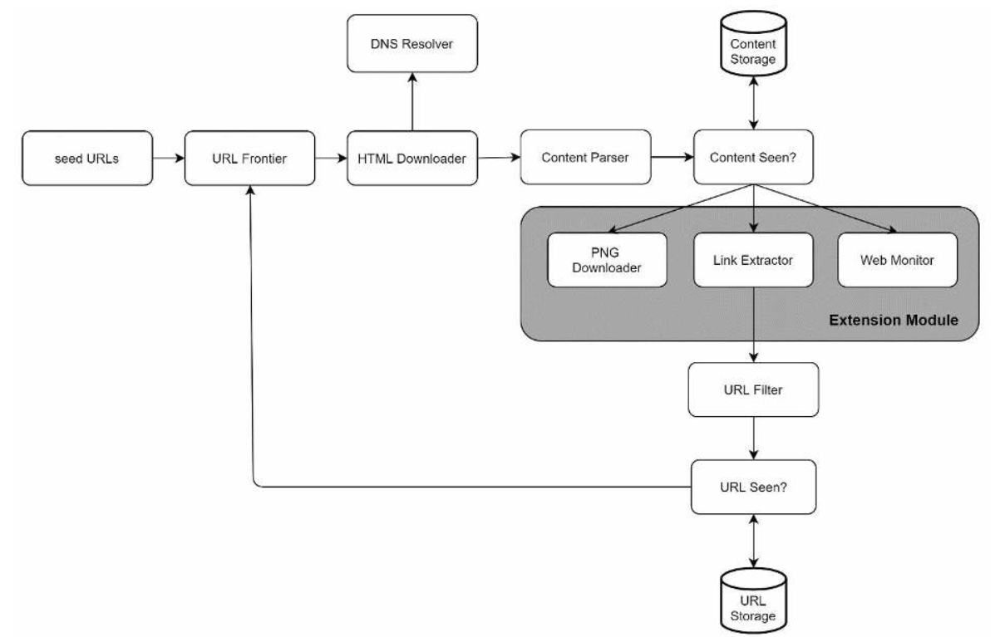

# 9장 웹 크롤러 설계

* 크롤러 활용
    - 검색 엔진 인덱싱
    - 웹 아키이빙
    - 웹 마이닝
    - 웹 모니터링

## 1단계 문제 이해 및 설계 범위 확정

* 웹 크롤링 기본 과정
    - URL 집합 입력 -> 모든 웹페이지 다운로드 -> 웹페이지 추출 -> 반복
* 요구사항 확인
    - 용도
    - 수집양
    - 신규/수정 페이지 수집 여부
    - 저장 기간
    - 중복 컨텐츠 처리
* 크롤러 설계시 주의사항
    - 규모 확장성
        - 병행 처리 필요
    - 안정성(robustness)
        - 잘못 작성된 HTML, 서버 장애, 악성 코드 대응
    - 예절(politeness)
        - 수집 정책(속도 조절)
    - 확장성(extensibility)
        - 여러 형태의 컨텐츠 지원
* 개략적 규모 산정
    - 매달 10억개의 웹페이지 다운로드
    - QPS = 10억/30일/24시간/3600초 = 대략 400페이지/초
    - 최대 QPS = 2 * QPS = 800
    - 웹 페이지의 평균 크기 500k라 가정
    - 10억 페이지 * 500k = 500TB/월
    - 5년 저장시 500TB * 12개월 * 5년 = 30PB

## 2단계 개략적 설계안 제시 및 동의 구하기

* 개략적 설계안
    - 
    - 시작 URL 집합
        - 전체 URL 공간을 작은 부분집합으로 나누는 전략
            - 지역적 특색이나 주제별로 다른 시작 URL 사용
    - 미수집 URL 저장소
        - 다운로드할 URL
        - FIFO 큐
    - HTML 다운로더
    - 도메인 이름 변환기
    - 컨텐츠 파서
        - 파싱과 검증
    - 중복 컨텐츠 여부
        - 웹페이지의 해시 값 비교
    - 컨텐츠 저장소
        - 기본적으로 디스크에 저장
        - 인기 컨텐츠는 캐시
    - URL 추출기
        - 상대 경로를 절대 경로로 변환
    - URL 필터
        - 크롤링 대상에서 배제
            - 특정 컨텐츠 타입이나 파일 확장자를 갖는 URL
            - 접속 시 오류가 발생하는 URL
            - 접근 제외 목록에 포함된 URL
    - 방문한 URL 여부 체크
        - 블룸 필터나 해시 테이블 사용
    - URL 저장소

## 3단계 상세 설계

* 구현 기술
    - DFS vs BFS
    - 미수집 URL 저장소
    - HTML 다운로더
    - 안정성 확보 전략
    - 확장성 확보 전략
    - 문제 있는 컨텐츠 감지 및 회피 전략
* DFS vs BFS
    - DFS의 경우 그래프 크기가 클 경우 어느 정도로 깊숙한지 가늠하기 어려움
    - BFS를 사용
* BFS 시 문제점
    - 예의 없는(impolite) 크롤러
        - 한 페이지에서 나오는 링크의 상당수는 같은 서버로 되돌아감
        - 병렬 처리시 대상 서버에 과부화
    - 우선 순위 처리 필요
        - 품질, 중요성 판단 필요
        - 페이지 순위, 사용자 트래픽 양, 업데이트 빈도 등으로 우선순위 구별 필요
* 미수집 URL 저장소
    - 우선순위와 신선도를 구별하는 크롤러 구현
    - 예의
        - 동일 웹사이트에 대해서는 한 번에 한 페이지만 요청
        - 웹 사이트의 호스트명과 다운로드를 수행하는 작업 스레드 사이의 관계 유지
            - 
            - 큐 라이터
                - 같은 호스트에 속한 URL은 언제나 같은 큐(b1, b2, ..., bn)로 가도록 보장
            - 매핑 테이블
            - FIFO 큐(b1 ~ bn)
                - 같은 호스트에 속한 URL은 언제나 같은 큐에 보관
            - 큐 선택기
                - 큐들을 순회하면서 큐에서 URL을 꺼내서 다운로드 작업 스레드에 전달
            - 작업 스레드
                - 전달된 URL을 다운로드하는 작업 수행
                - 태스크 사이에 지연주기
                - 큐와 작업 스레드는 1:1 구조인가???
                - 큐의 개수와 작업풀의 개수를 조절하면서 자연스러운 지연을 유도해도 좋지 않을까?
                    - 큐의 개수가 100개(100개 호스트)라면 스레드풀은 10%인 10개만 유지해도 적절히 지연이 이뤄지지 않을까?
                    - 
    - 우선순위
        - 
        - 순위결정장치
            - 우선 순위 계산
        - 큐(f1, ..., fn)
            - 우선순위별로 큐 할당
        - 큐 선택키
            - 순위가 높은 큐에서 더 자주 꺼냄
    - 우선순위 처리 과정과 예의 처리 과정
        - 
    - 신선도
        - 이미 다운로드한 페이지라도 주기적으로 재수집 필요
            - 웹 페이지 변경 이력 활용
            - 우선순위를 활용하여, 중요한 페이지는 좀 더 자주 재수집
    - 미수집 URL 저장소를 위한 지속성 저장장치
        - 메모리 버퍼에 큐를 두고 버퍼에 있는 데이터를 주기적으로 디스크에 기록
* HTML 다운로더
    - Robots.txt
        - 반복적 다운로드하는 것을 피하기 위해, 주기적으로 다운받아 캐시 보관
    - 성능 최적화
        - 분산 크롤링
        - 도메인 이름 변환 결과 캐시
        - 지역성
        - 짧은 타임아웃
        - 안정성
            - 안정해시를 이용하여 다운로더 서버들에 부하 분산
            - 크롤링 상태 및 수집 데이터 저장
                - 크롤링 상태와 수집된 데이터를 지속적 저장장치에 기록
                - 장애시 재시작
                - 스프링 배치와 동일
            - 에러 처리
            - 데이터 검증
        - 확장성
            - 
        - 문제 있는 컨텐츠 감지 및 회피
            - 중복 컨텐츠
                - 해시나 체크섬 이용
            - 거미 덫
                - host.com/foo/bar/foo/bar/...
                - 수작업으로 URL 필터 목록에 등록
            - 데이터 노이즈

## 4단계 마무리

* 서버측 렌더링

| 렌더링 방식     | 설명                | 크롤링(SEO) 관점         |
|------------|-------------------|---------------------|
| **SSR**    | 요청 시 서버에서 HTML 생성 | ✅ 아주 좋음 (실시간 반영 가능) |
| **SSG**    | 빌드 타임에 HTML 미리 생성 | ✅ 아주 좋음 (빠르고 안정적)   |
| **ISR**    | SSG + 주기적 재생성     | ✅ 좋음 + 콘텐츠 최신 유지 가능 |
| **CSR**    | 클라이언트에서 JS로 렌더링   | ⚠️ JS 미지원 크롤러에 불리함  |
| **동적 렌더링** | 크롤러에만 SSR 제공      | ✅ SEO 보완용 (하이브리드)   |

* 데이터베이스 다중화 및 샤딩
* 수평적 규모 확장성
    - 무상태 서버
* 가용성, 일관성, 안정성
* 데이터 분석 솔루션