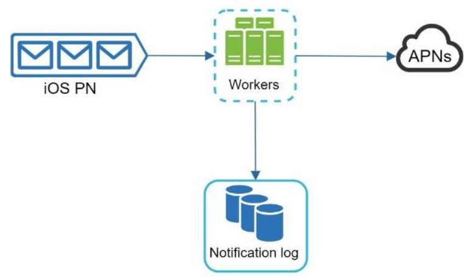

# 10장 알림 시스템 설계

## 1단계 문제 이해 및 설계 범위 확정

* 요구사항 분석
    - 알림의 종류
    - 실시간 여부
    - 지원 단말
    - 알림 생성자
    - 사용자 알림 거부
    - 하루 전송량

## 2단계 개략적 설계안 제시 및 동의 구하기

* 개략적 설계안
    - 알림 유형별 지원 방안
    - 연락처 정보 수집 절차
    - 알림 전송 및 수신 절차
* 알림 유형별 지원 방안
    - 
* 알림 전송 및 수신 절차
    - 
    - 데이터베이스와 캐시를 알림 시스템의 주서버에서 분리
    - 수평적 규모 확장 지원
    - 메시지 큐를 이용해 시스템 컴포넌트 사이의 강결합 제거

## 3단계 상세 설계

* 추가 고려사항
    - 안정성
        - 데이터 손실 방지
            - 
            - 재시도 매커니즘 구현
        - 알림 중복 전송 방지
            - 이벤트 ID를 검사하여 중복된 이벤트 발송 제외
    - 알림 템플릿
    - 알림 설정
        - 사용자가 알림 받을지 말지에 대한 설정
    - 전송률 제한
        - 알림 빈도 제한
    - 재시도 매커니즘
        - 재시도 전용 큐 도입
    - 보안
        - 3rd 서비스 보안(appKey, appSecret)
    - 큐 모니터링/이벤트 추적
* 수정된 설계안
    - 

## 4단계 마무리

* 주요 주제
    - 안정성
    - 보안
    - 이벤트 추적 및 모니터링
    - 사용자 설정
    - 전송률 제한