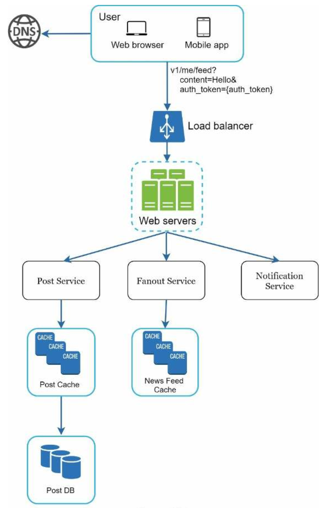
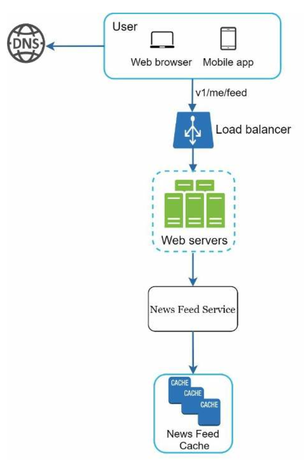
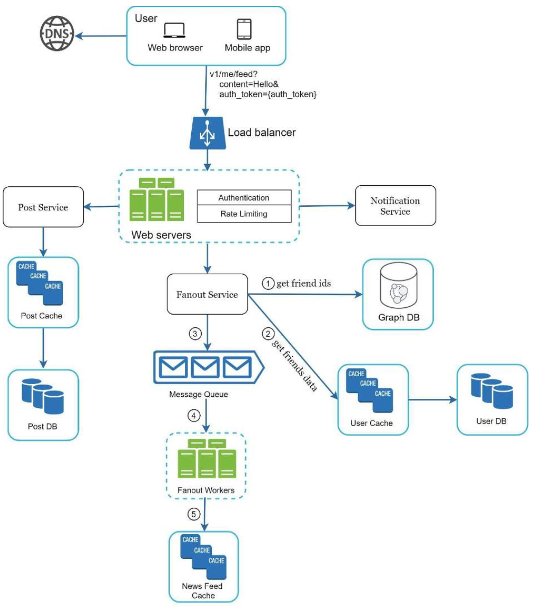
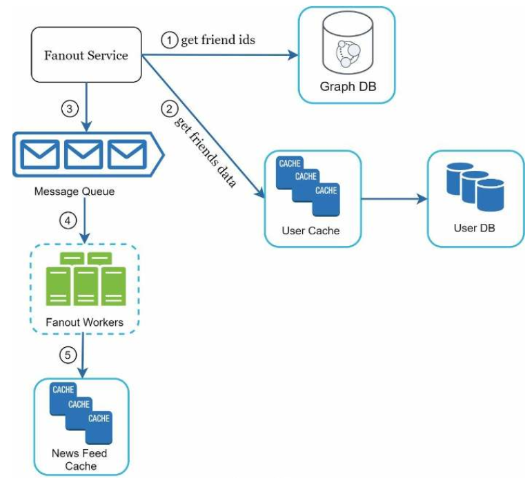
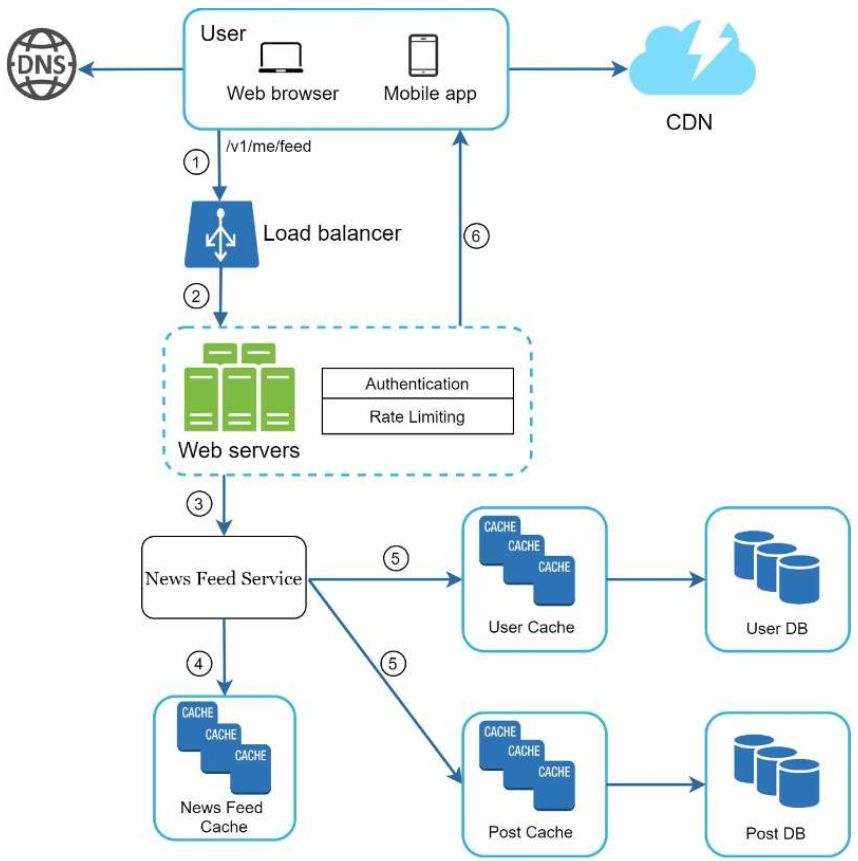
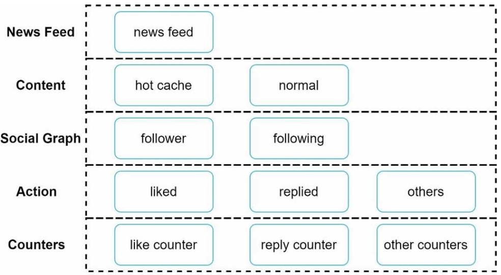

# 11장 뉴스 피드 시스템 설계
## 1단계 문제 이해 및 설계 범위 확정
* 요구사항 파악
    - 모바일/웹 지원 여부
    - 주요 기능
    - 뉴스 피드 표시 순서
    - 최대 친구수
    - 트래픽 규모
    - 피드 컨텐츠 타입
## 2단계 개략적 설계안 제시 및 동의 구하기
* 주요 기능
    - 피드 발행
        - 사용자가 스토리를 포스팅하면 캐시와 데이터베이스에 저장
    - 뉴스 피드 생성
        - 모든 친구의 포스팅을 시간 역순으로 표시
* 피드 발행
    - 
    - 포스팅 저장 서비스
        - 새 포스팅을 데이터베이스와 캐시에 저장
    - 포스팅 전송 서비스
        - 새 포스팅을 친구의 뉴스피드에 push
    - 알림 서비스
        - 친구들에게 새 포스팅 알림
* 뉴스 피드 생성
    - 
    - 뉴스 피드 서비스
        - 캐시에서 뉴스 피드를 가져오는 서비스
    - 뉴스 피드 캐시
        - 뉴스 피드를 렌더링할 때 필요한 피드 ID를 보관
## 3단계 상세 설계
* 피드 발행 흐름 상세 설계
    - 
    - 포스팅 전송(팬아웃) 서비스
        - 쓰기 시점 팬아웃
            - 새로운 포스팅을 기록하는 시점에서 뉴스 피드 갱신
            - 장점
                - 사용자에게 즉시 전송
                - 읽는 시간이 빨라짐
            - 단점
                - 친구가 많은 사용자의 경우 뉴스피드를 갱신하는데 많은 시간 소요(핫키)
                - 모든 사용자의 피드를 갱신하므로 컴퓨팅 자원 낭비
        - 읽기 시점 팬아웃
            - 피드를 읽는 시점에 뉴스 피드를 갱신
            - 장점
                - 비활성화된 사용자, 자주사용하지 않는 사용자가 있는 경우 유리
                - 핫키 문제 발생 안함
            - 단점
                - 뉴스 피드를 읽는데 많은 시간 소요
        - 절충안
            - 
            - 뉴스 피드 캐시에 포스팅 전체를 저장하지 않고 포스팅 ID와 사용자 ID만 저장
    - 피드 읽기 흐름 상세 설계
        - 
        - 뉴스 피드 캐시에서 포스팅 ID 목록을 가져옴
        - 사용자 캐시와 포스팅 개시에서 필요한 정보를 가져와서 완전한 뉴스 피드 생성
    - 캐시 구조
        - 
        - 다섯 계층으로 나눠서 캐시 운영
            - 뉴스 피드
            - 컨텐츠
            - 소셜 그래프
            - 행동
            - 횟수

## 4단계 마무리
* 추가 논의 사항
    - 데이터베이스 규모 확장
    - 웹 계층 무상태 운영
    - 캐시 방법
    - 여러 데이터 센터 지원 방법
    - 메시지 큐를 사용한 컴포넌트 결합 낮추기
    - 핵심 메트릭에 대한 모니터링
        - [zipkin](https://zipkin.io/)
        - [prometheus](https://prometheus.io/)