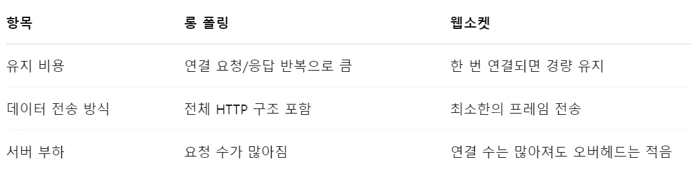

# 12장 채팅 시스템 설계
## 1단계 문제 이해 및 설계 범위 확정
* 요구사항 정리
    - 1:1, 그룹채팅
    - 모바일/웹 지원
    - 일별 능동 사용자 수(DAU) : 5천만 DAU
    - 그룹 채팅 최대 100명
    - 사용자 접속상태 표시
    - 메시지 길이 10만자 이하
    - 종단간 암호화 불필요
    - 채팅 이력 저장
    - 하나의 계정으로 여러 단말에 동시 접속 지원
    - 푸시 알림
## 2단계 개략적 설계안 제시 및 동의 구하기
* 기본 기능
    - 클라이언트들로부터 메시지 수신
    - 메시지 수신자 결정 및 전달
    - 수신자가 접속 상태가 아닌 경우 접속할때까지 메시지 보관
    - !!! 그림 12-2
* 메시지 송신 관점
    - HTTP 사용
        - Connection 헤더와 Keep-Alive 헤더 사용으로 TCP 접속 과정에서 발생하는 핸드세이크 횟수 줄임
        - [HTTP Headers](https://developer.mozilla.org/en-US/docs/Web/HTTP/Reference/Headers)
        ```
        Connection: keep-alive
        Keep-Alive: timeout=5, max=100
        ```
        - HTTP/1.1 부터는 Connection 헤더는 기본 기능
* 메시지 수신 관점
    - 폴링
        - 클라이언트가 주기적으로 서버에게 새 메시지가 있는지 확인하는 방법
    - 롱 폴링
        - 클라이언트는 새 메시지가 반환되거나 타임아웃 될 때가지 연결 유지
    - 웹소켓
        - 클라이언트에게 비동기 메시지를 전송
        - !!! 그림 12-5
        - 
* 최종 선택
    - 메시지 송수신 모두 웹소켓 선택
* 개략적 설계안
    - !!! 그림 12-7
    - 무상태 서비스
        - 로그인, 회원기입, 사용자 프로파일
        - 서비스 탐색 서비스
            - DNS, Eureka, Ingress
    - 상태유지 서비스
        - 채팅 서비스
        - 각 클라이언트가 채팅 서버와 독립적인 네트워크 연결 유지
        - 부하 관리 필요
    - 제3자 서비스 연동
        - 푸시 알림 서비스와의 통합
* 규모 확장성을 고려한 설계안
    - !!! 그림 12-8
    - 채팅 서버는 클라이언트 사이에 메시지를 중계하는 역할 담당
    - 접속상태 서버는 사용자의 접속 여부를 담당
    - API 서버는 로그인, 회원가입, 프로파일 변경 등 처리
    - 알림 서버는 푸시 알람 전송
    - 키-값 저장소는 채팅 이력 보관
* 저장소
    - 일반적 데이터
        - 사용자 정보, 설정, 친구 목록
        - 관계형 데이터베이스에 보관
        - 다중화, 샤팅 고려
    - 채팅 이력
        - 읽기/쓰기 패턴
            - 채팅 이력 데이터의 양은 엄청남
            - 상용 메신저는 매일 600억개 이상의 메시지를 처리
            - 빈번하게 사용되는 것은 최근 메시지
            - 검색/언급/점프/무작위 접근 등 지원 필요
            - 1:1 채팅의 경우 읽기:쓰기 비율 대략 1:1
        - 키-값 저장소 추천 이유
            - 수평적 규모확장
            - 데이터 접근 지연시간이 낮음
            - 관계형 데이터베이스는 롱 테일에 대한 대응이 약함
            - 인덱스가 커지면 데이터에 대한 무작의적 접근을 처리하는 비용이 늘어남
* 데이터 모델
    - 1:1 채팅을 위한 메시지 테이블
        - message_id(*)
        - message_from
        - message_to
        - content
        - created_at
    - 그룹 채팅을 위한 메시지 테이블
        - channel_id(*)
        - message_id(*)
        - message_from
        - message_to
        - content
        - created_at
* 메시지 ID
    - message_id의 값은 고유해야 함
    - ID 값은 정렬 가능해야 함
    - 생성 방법
        - RDBMS : auto_increment
        - 전역적 64-bit 순서 번호 생성기(스노플레이크)
        - 지역적 순서 번호 생성기
            - ID의 유일성은 같은 그룹안에서만 보증
## 3단계 상세 설계
* 서비스 탐색
    - 클라이언트에게 가장 적합한 채팅 서버 추천
        - 클라이언트의 위치, 서버의 용량 고려
        - e.g. 아파치 주키퍼 등
    - !!! 그림 12-11
* 메시지 흐름
    - 1:1 채팅 메시지 처리 흐름
        - !!! 그림 12-12
    - 여러 단말 사이의 메시지 동기화
        - !!! 그림 12-13
        - 각 단말에서 가장 최신 메시지의 ID 저장(cur_max_message_id)
        - 키값 저장소에 보관된 message_id와 cur_max_message_id 와 비교
    - 소규모 그룹 채팅에서의 메시지 흐름
        - 송신자 관점
            - !!! 그림 12-14
            - 사용자 A가 메시지 송신시 사용자 B,C의 메시지 동기화 큐에 복사
                - 메시지 동기화 플로우가 단순
                - 그룹이 크지 않으면 메시지를 수신자별로 복사해서 큐에 넣는 작업의 비용이 문제가 되지 않음
        - 수신자 관점
            - !!! 그림 12-15
* 접속상태 표시
    - 사용자 로그인
        - A가 로그인 시 A의 상태(online)와 last_active_at 타입스탬프 값을 키-값 저장소에 보관
    - 로그아웃
        - A의 상태를 offline으로 변경
    - 접속 장애
        - 네트워크 오류 상황을 고려하여 heartbeat 체크를 통한 상태 확인
        - !!! 그림 12-18
    - 상태 정보의 전송
        - 사용자 A와 친구관계 있는 사용자들은 A의 상태 변화를 알 수 있을까?
        - 친구관계마다 채널을 하나씩 두는 것
        - !!! 그림 12-19
## 4단계 마무리
* 마무리!!
    - 실시간 통신을 위한 웹소켓
    - 접속상태 서버, 푸시 알림 서버, 채팅 이력 보관할 키-값 저장소
    - 부가 기능을 위한 API 서버
* 추가 고려 사항
    - 사진이나 비디오 등의 미디어 지원
        - 압축 방식, 클라우드 저장소, 섬네일 생성 등
    - 종단 간 암호화
    - 클라이언트에서 읽은 메시지 캐시
    - 로딩 속도 개선: 사용자의 데이터, 채널 등을 지역적으로 분산하는 네트워크 구축
    - 오류 처리
        - 채팅 서버 오류: 서비스 탐색 기능이 오류에 대한 지원 필요
        - 메시지 재전송