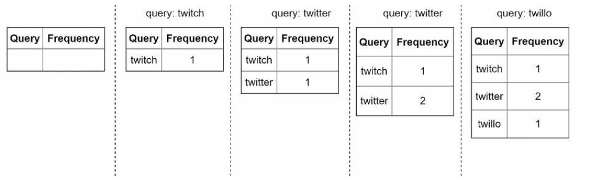
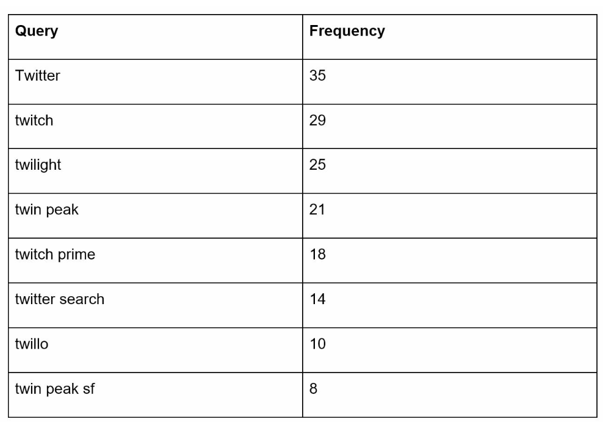
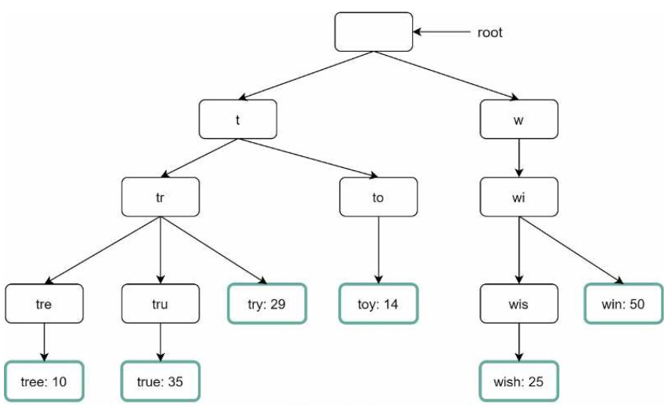
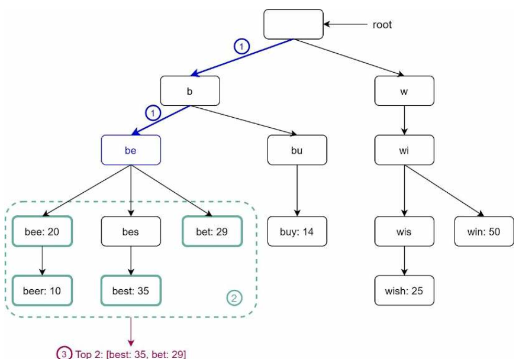
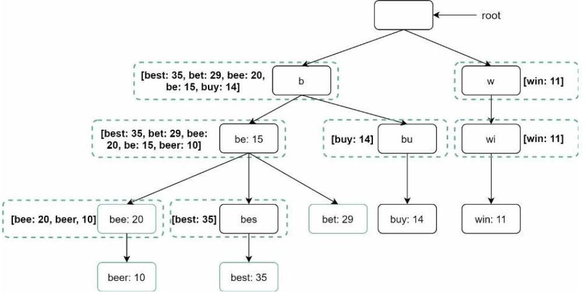
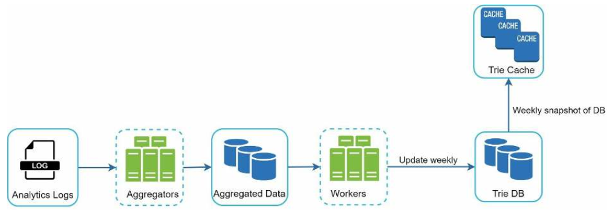
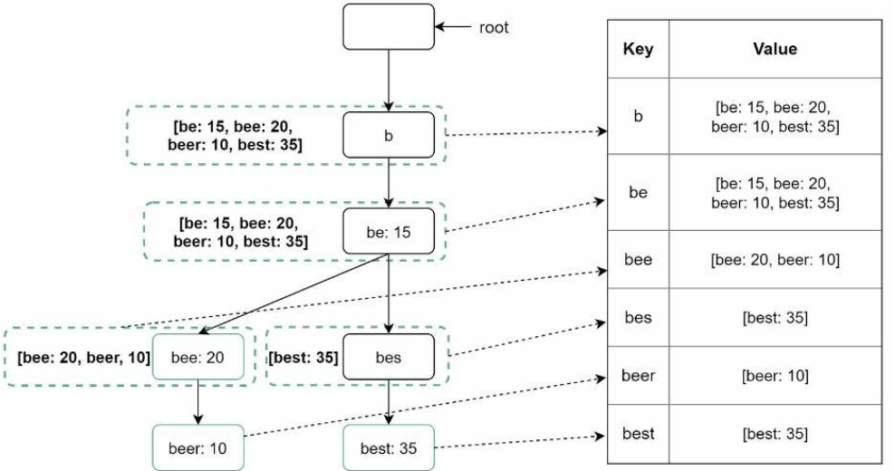
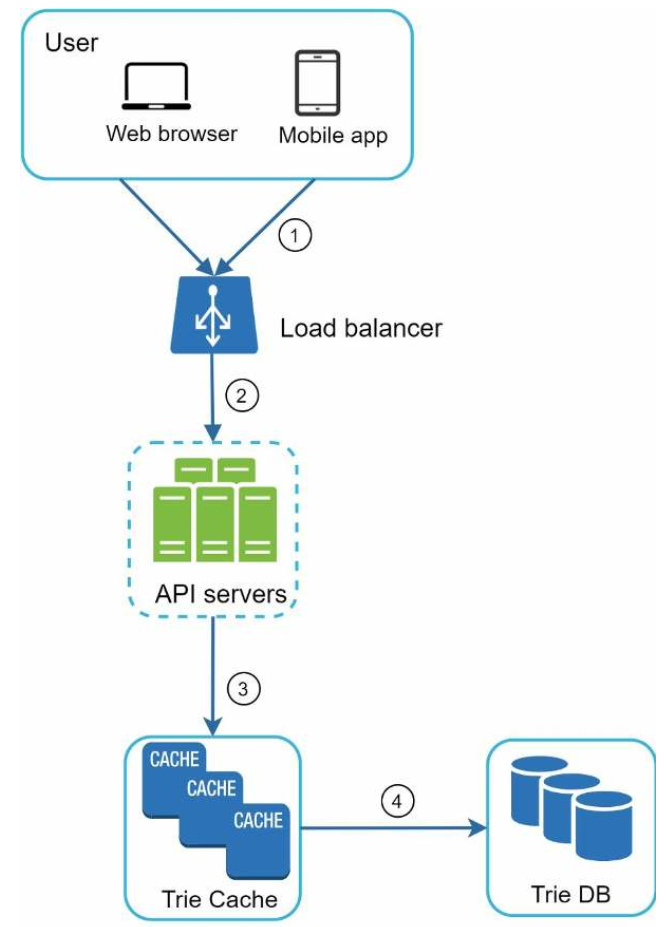
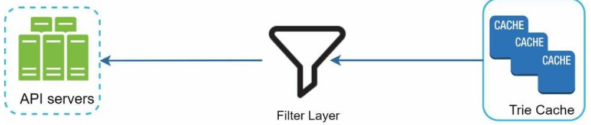
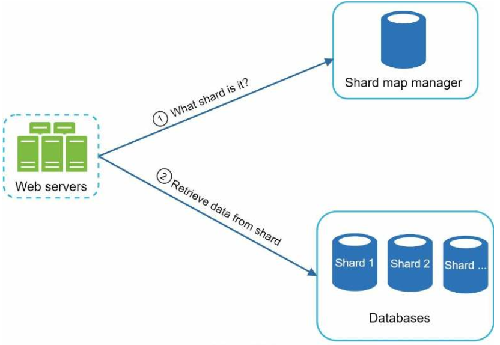

# 13장 검색어 자동완성 시스템
## 1단계 문제 이해 및 설계 범위 확정
* 목표: 가장 많이 이용된 검색어 k개를 자동완성하여 출력하는 시스템
* 범위 선정
    - 자동완성될 검색어는 검색어의 첫부분
    - 질의 빈도에 따른 자동완성 검색어 5개 표시
    - 맞춤법 검사 및 자동수정 미지원
    - 영어 기반, 다국어 고려
    - 1000만 DAU
* 요구사항
    - 빠른 응답 속도
    - 연관성
    - 순위 모델에 의한 정렬
    - 규모 확장성
    - 고가용성
* 개략적 규모 추정
    - 1000만 DAU
    - 한 사용자는 매일 10건 검색 수행 가정
    - 질의할 때 평균 20바이트의 데이터를 입력한다고 가정
        - 4단어
        - 단어당 5문자
    - 1회 검색당 20건의 요청이 백엔드로 전달
    - QPS : 24,000 QPS( = 1000만명 * 10질의/일 * 20자 / 24시간 / 3600초)
    - 최대 QPS : 48,000 QPS
    - 매일 20% 신규 검색어라 가정
        - 0.4GB 생성( = 1000만명 * 10질의/일 * 20자 * 20%)
## 2단계 개략적 설계안 제시 및 동의 구하기
* 데이터 수집 서비스
    - 사용자가 입력한 질의를 실시간으로 수집하는 시스템
    - 
* 질의 서비스
    - 주어진 질의에 다섯개의 인기 검색어를 정렬해 내놓는 서비스
    - 
    - SQL 활용
    ```
    SELECT * FROM frequecy_table
    WHERE query Like 'prefix%'
    ORDER BY frequency
    LIMIT 5
    ```
## 3단계 상세 설계
* 트라이(trie) 자료구조
    - 트라이(혹은 접두어 트리(prefix tree)라고도 함)
    - 'retrieval'에서 유래
    - 트리 형태의 자료구조
    - 루트 노드는 빈 문자열
    - 각 노드는 글자 하나를 저장(26개의 자식노드를 가질 수 있음)
    - 각 트리 노드는 하나의 단어(접두어 문자열)를 나타냄
    - 
    - 용어 정의
        - p: 접두어의 길이
        - n: 트라이 안에 있는 노드 개수
        - c: 주어진 노드의 자식 노드 개수
    - k개의 질의어 찾을 시
        - 해당 접두어를 표현하는 노드 찾는 시간 복잡도 : O(p)
        - 하위 트리를 탐색하여 모든 유효 노드를 찾는 시간 복잡도: O(c)
        - 유효 노드들을 정렬하여 가장 인기 있는 검색어 k개를 찾는 시간 복잡도 : O(clogc)
    - e.g. k=2 이고 'be'를 입력했을 경우
        - 
        - O(p) + O(c) + O(clogc)
    - 매번 k개의 결과를 얻기 위해 트라이를 다 검색해야 하는 성능 문제 발생
        - 접두어의 최대 길이 제한
            - O(p)에서 O(상수) = O(1)로 변경
        - 각 노드에 인기 검색어를 캐시
            - 
            -  최종 시간복잡도 O(1)
* 데이터 수집 서비스
    - 타이핑할때마다 트라이 갱신 할 필요가 있는가?
        - 데이터 분석에 대한 데이터 출처에 대한 고민 필요
    - 데이터 분석 서비스의 수정된 설계안
        - 
        - 주기적인 데이터 취합
        - 트라이 캐시
            - 트라이 데이터를 메모리에 유지
            - 매주 트라이 데이터베이스의 스냅샷을 떠서 갱신
        - 트라이 데이터베이스
            - 지속성 저장소
                - ducument store: 새 트라이를 매주 만들 것이므로, 트라이를 직렬화하여 데이터베이스에 저장
                - e.g. 몽고디비
            - 키-값 저장소
                - 노드의 접두어를 해시 테이블 키로 변환
                - 각 트라이 노드에 보관된 모든 데이터를 해시 테이블 값으로 변환
                - 
* 질의 서비스
    - 
    - 최적화 방안
        - AJAX 요청으로 검색어 목록 가져옴
        - 브라우저 캐싱
            - cache-control header 활용
            ```
            cache-control: private; max-age=3600
            ```
        - 데이터 생플링
            - N개의 요청 가운데 1개만 로깅
* 트라이 연산
    - 트라이 생성
        - 작업 서버가 담당
        - 데이터 분석 서비스의 로그나 데이터베이스로부터 취합된 데이터 이용
    - 트라이 갱신
        - 매주 갱신하여 기존 트라이 대체
        - 트라이의 각 노드를 개별적으로 갱신(상위 노드도 갱신해줘야 해서 선택 안함)
    - 검색어 삭제
        - 트라이 캐시 앞에 핀터 계층을 두고 부적절한 질의어가 반환되지 않도록 함
            - 
            - 다움번 업데이트 사이클에 물리적으로 삭제
* 저장소 규모 확장
    - 샤딩 고려
        - 알파벳 range별로 서버에 저장
            - 균등한 분배가 어려움
        - 별도의 검색어 대응 샤드 관리자를 두어 관리
            - 
## 4단계 마무리
* 추가 고려사항
    - 다국어 지원
        - 트라이에 유니코드 데이터 저장
    - 국가별로 인기 검색어 순위가 다른 경우
        - 트라이를 CDN에 저장하여 응답 속도를 높임
    - 실시간성을 고려한다면?
        - 샤딩을 통하여 작업 대상 데이터의 양을 줄임
        - 순위 모델을 바꾸어 최근 검색어에 보다 높은 가중치를 주기
        - 데이터가 스트림 형태임을 고려
            - 기존 일주일 단위 batch 작업에서 스트림 엔진/분석 툴 도입 검토
        
