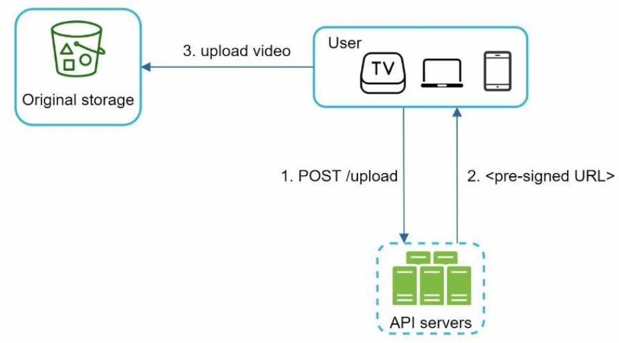

# 유튜브 설계
* 2020년 유튜브 영향력
    - 월간 능등 사용자 수 : 2십억명
    - 매일 재생되는 비디오 수 : 5십억개
    - 미국 성인 가운데 73% 유튜브 이용
    - 5천만명의 크리에이터
    - 2019년 유튜브 광고 수입 150억 달러, 2018년 대비 36% 증가
    - 모바일 인터넷 트래픽 가운데 37%를 유튜브가 점ㅇ유
    - 80개 언어로 이용 가능
## 1단계 문제 이해 및 설계 범위 확정
* 확인할 항목
    - 주요 기능
        - 비디오 업로드와 시청
    - 지원 클라이언트
        - 모바일 앱, 웹 브라우저, 스마트 TV
    - 일간 능동 사용자 수
        - 5백만명
    - 사용자가 평균적으로 소비하는 시간
        - 30분
    - 다국어 지원여부
        - 모든 언어
    - 비디오 해상도
        - 모든 비디오 종류와 해상도
    - 암호화 여부
        - 암호화 필요
    - 비디오 파일 크기 제한
        - 최대 1GB로 제한
    - 클라우드 활용가능 여부
        - 활용 가능
* 개략적 규모 추정
    - 일간 능동 사용자 : 5백만
    - 한 사용자는 하루에 평균 5개의 비디오를 시청
    - 10%의 사용자가 하루에 1비디오 업로드
    - 비디오 평균 크기 : 300MB
    - 비디오 저장 공간 = 5백만 x 10% x 300MB = 150TB
    - CDN 비용
        - 1GB당 $0.02 요금 가정
        - 매일 발생하는 비용 = 5백만 x 5비디오 x 0.3GB x $0.02 = $150,000
## 2단계 개략적 설계안 제시 및 동의 구하기
* 클라우드 활용
    - CDN : 비디오 컨텐츠 제공
        - 넷플리스 : 아마존의 클라우드 서비스
        - 페이스북 : 아카마이의 CDN 이용
    - BLOB 스토리지 : 비디오 저장
* 구성 컴포넌트
    - 
    - 단말 : 컴퓨터, 모바일폰, 스마트 TV 등
    - CDN : 스트리밍 제공
    - APU 서버
        - 피드 추천
        - 비디오 업로드 URL 생성
        - 메타데이터 데이터베이스
        - 캐시 갱신
        - 사용자 관리
* 개략적인 설계안
    - 
    - 메타데이터 데이터베이스
        - 비디오의 메타데이터 보관
        - 샤딩과 다중화(replication)를 적용
    - 메타데이터 캐시
        - 비디오 메타데이터와 사용자 객체 캐시
    - 원본 저장소
        - 원본 비디오 저장
        - 대형 이진 파일 저장소(BLOB)
        - 이진 데이터를 하나의 개체로 보관하는 데이터베이스 관리 시스템
    - 트랜스코딩 서버
        - 비디오 인코딩
        - 비디오 포멧 변환
        - 대역폭 변경
    - 트랜스코딩 비디오 저장소
        - 트랜스코딩이 완료된 BLOB 저장소
    - CDN
        - 비디오 스트리밍
        - 비디오 캐시
    - 트랜스코딩 완료 큐
        - 비디오 트랜스코딩 완료 이벤트를 보관할 메시지 큐
    - 트랜스코딩 완료 핸들러
        - 이벤트 데이터를 반영
        - 메타데이터 캐시와 데이터베이스 갱신
* 비디오 업로드 절차
    - 
    - 비디오 업로드
        - 트랜스코딩 진행
        - 트랜스코딩이 완료된 비디오를 CDN으로 전달
    - 비디오 메타데이터 갱신
        - 비디오 URL, 크기, 해상도, 포멧, 사용자 정보
* 비디오 스트리밍 절차
    - 스트리밍: 원격지의 비디오로부터 지속적으로 비디오 스트림을 전송 받아 영상을 재생하는 것
    - 스트리밍 프로토콜
        - HTTP 기반 적응형 스트리밍: HLS, MPEG-DASH (웹/모바일 호환성, 대중적)
        - 실시간/저지연 송출: RTMP, SRT, WebRTC, RTSP (실시간 방송, CCTV, 화상회의 등)
## 3단계 상세 설계
* 비디오 트랜스코딩의 필요성
    - 원본 비디오의 저장 공간
    - 일관된 비디오 인코딩 포멧 유지
    - 다양한 비디오 화질 제공
    - 비디오 화질 자동 변환
* 인코딩 포멧 구성
    - 컨테이너
        - 비디오 파일, 오디오, 메타데이터 정보 관리
        - .avi, .mov, .mp4 파일 확장자로 구분
    - 코덱
        - 비디오 압축 알고리즘
        - H.264, VP9, HEVC 등
* 유형 비순환 그래프(DAG) 모델
    - 비디오 트랜스코딩은 유연성과 병렬성 필요
        - DAG 모델 도입
    - 
    - 검사: 비디오 품질 확인
    - 비디오 인코딩: 다양한 해상도, 코덱, 비트레이트 조절
    - 섬네일: 비디오에서 이미지 섬네일 추출
    - 워터마크: 비디오 식별 정보를 이미지 위에 오버레이 형태로 띄워 표시
* 비디오 트랜스코딩 아키텍처
    - 
    - 전처리기
        - 비디오 분할
            - GOP(Group of Pictures)라는 단위로 쪼갬
            - GOP는 특정 순서로 배열된 프레임 그룹
            - GOP는 독립적 재생 가능
        - DAG 생성
            - 프로그래머가 작성한 설정 파일에 따라 DAG를 생성
                - 영상을 다운로드하고 트랜스코드 진행
            - DAG 예시
                - 
                - AWS Step Functions, Netflix Conductor, Argo Workflows
        - 데이터 캐시
            - 분할된 비디오의 캐시
            - GOP와 메타데이터를 임시 저장소에 보관
    - DAG 스케줄러
        - DAG 그래프를 여러 단계로 분할한 다음 정해진 작업큐에 전송
        - 해야할 작업을 동적 생성
        - 
    - 자원 관리자
        - 작업큐에 들어온 작업들에 대한 자원 배분을 효과적으로 수행하는 역할
        - 
    - 작업 실행 서버
        - DAG에 정의된 작업 수행
    - 임시 저장소
        - 여러 저장소 시스템에서 활용
        - 메타데이터는 메모리에 캐시
        - 비디오/오디오 데이터는 BLOB 저장소에 보관
        - 비디오 프로세싱이 완료되면 삭제
* 시스템 최적화
    - 속도 최적화
        - GOP로 분할하여 병렬 업로드
        - 지역 업로드 센터 이용(CDN 활용)
        - 모든 절차 병렬화
            - 
            - 메시지큐 활용
            - 
    - 안전성 최적화
        - 미리 사인된 업로드 URL
            - 
        - 비디오 보호
            - 저작권 관리
            - 암호화: AES
            - 워터마크
    - 비용 최적화
        - 인기 있는 비디오에 집중(롱테일 분포)
            - 
* 오류 처리
    - 회복 가능 오류
        - 트랜스코딩 실패시 주기적으로 재시도
        - 복구 불가시 클라이언트에게 오류 코드 반환
    - 회복 불가능 오류
        - 포멧 오류
        - 작업 중단 및 클라이언트에게 오류 코드 반환
* 오류 대응
    - 업로드 오류 : 몇 회 재시도
    - 비디오 분할 오류 : 전체 비디오 전송 및 서버에서 GOP 분할
    - 트랜스코딩 오류 : 재시도
    - 전처리 오류 : DAG 그래프 재생성
    - 자원 관리자 큐에 장애 발생 : 사본 활용
    - 작업 서버 장애 : 다른 서버에서 해당 작업 재시도
    - API 서버 장애 : 다른 API 서버로 우회
    - 메타데이터 캐시 서버 장애 : 캐시 서버 교체
    - 메타데이터 데이터베이스 서버 장애 : 서버 교체
## 4단계 마무리
* 추가 논의 사항
    - API 계층 확장 - 무상태 서버
    - 데이터베이스 계층의 규모 확장 - 다중화, 샤딩
    - 라이브 스트리밍 
        - 실시간 녹화 방송
        - 응답지연이 낮아야 하므로 스트리밍 프로토콜 선정에 유의
        - 작은 단위의 데이터를 실시간으로 처리해야 하므로 병렬화 필요성 감소
        - 너무 오래 걸리는 오류 처리는 변경
    - 비디오 삭제
        - 서버 검열
        - 사용자 신고 절차
