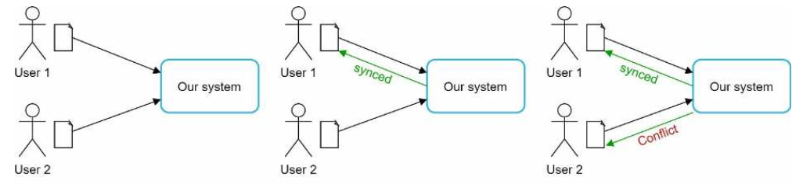
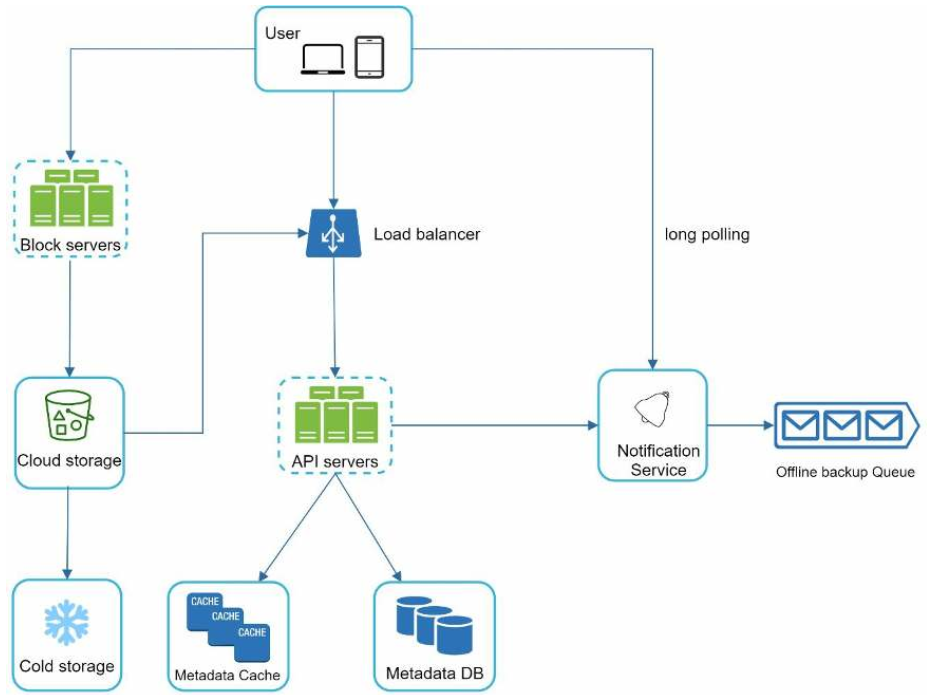
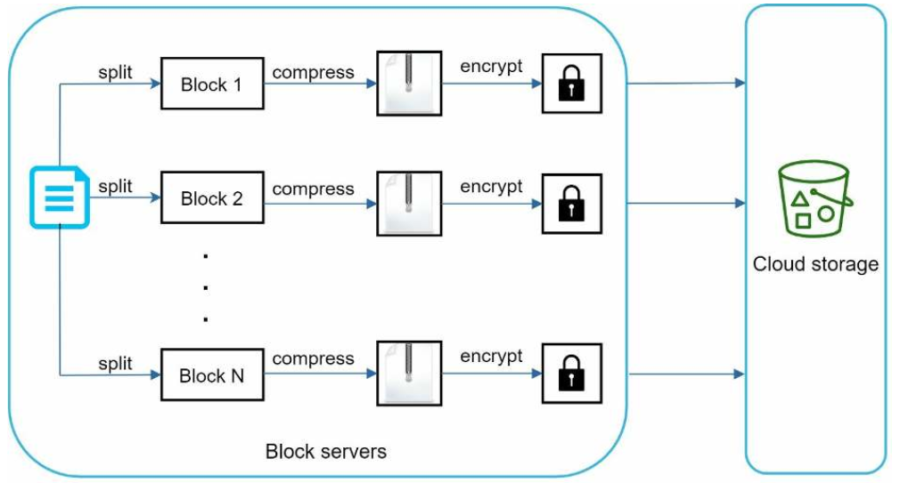
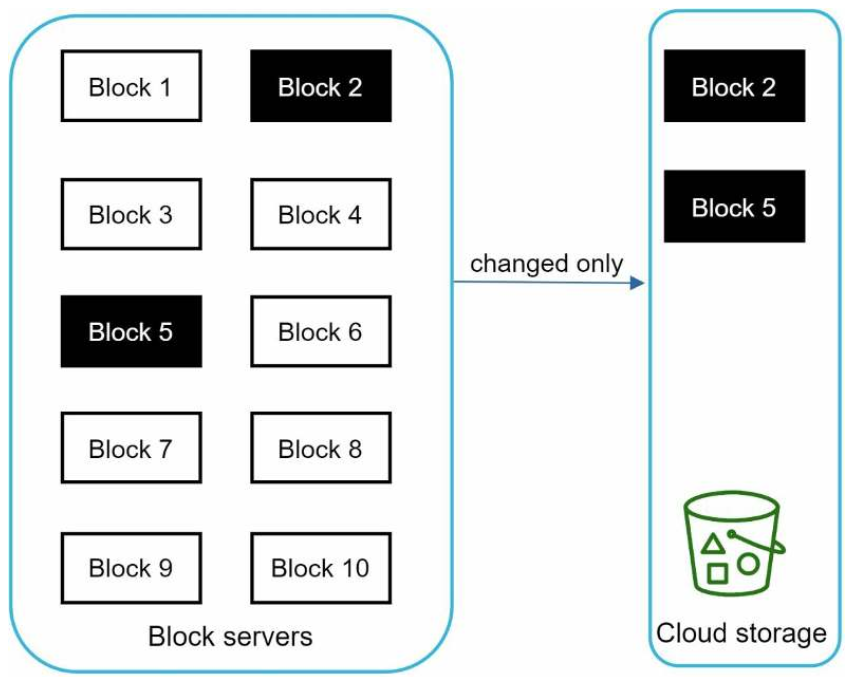
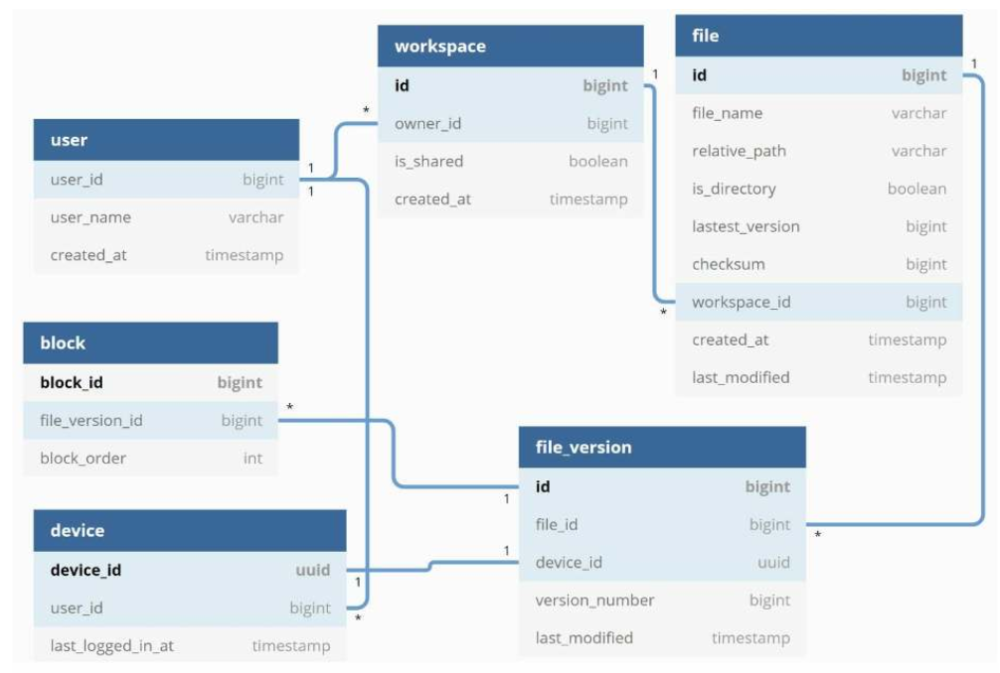
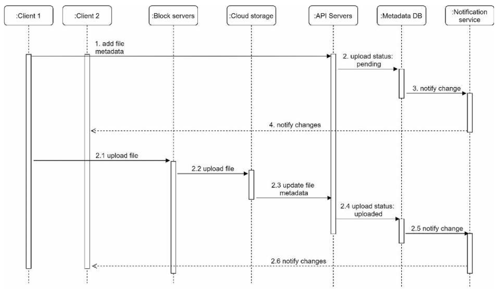
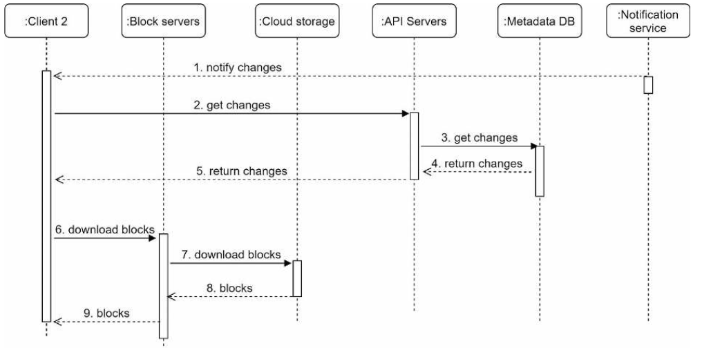

# 구글 드라이브 설계

## 1단계 문제 이해 및 설계 범위 확정

* 확인할 항목
    - 주요 기능
        - 파일 업로드/다운로드, 파일 동기화, 알림
    - 지원 클라이언트
        - 모바일 앱/웹
    - 파일 암호화 여부
        - 필요
    - 파일 크기 제한
        - 10GB
    - 일간 사용자
        - 천만명
* 기능 정리
    - 파일 추가 - 드래그앤드랍
    - 파일 다운로드
    - 여러 단말에 동기화
    - 파일 갱신 이력 조회
    - 파일 공유
    - 파일 편집,삭제,공유사항에 대한 알림 표시
* 비기능 정리
    - 안정성
    - 빠른 동기화
    - 네트워크 대역폭
    - 규모 확장성
    - 높은 가용성
* 개략적 규모 산정
    - 가입 사용자 : 5천만명
    - 1천만명의 DAU
    - 모든 사용자에게 10GB 무료 저장공간 할당
    - 매일 각 사용자가 평균 2개의 파일 업로드
    - 각 파일의 평균 크기 : 500KB
    - 읽기:쓰기 비율 1:1
    - 필요한 저장공간 = 5천만 사용자 x 10GB = 500 페라바이트
    - 업로드 API QPS = 1천만 사용자 x 2회 업로드/24시간/3600초 = 240 QPS
    - 최대 QPS = QPS x 2 = 480 QPS

## 2단계 개략적 설계안 제시 및 동의 구하기

* 필요한 API
    - 파일 업로드 API
        - 단순 업로드
        - 이어 올리기
            - 이어 올리기 URL을 받기 위한 최초 요청 전송
    - 다운로드 API
    - 파일 갱신 히스토리 API
* 한 대의 서버 제약 극복
    - 샤딩 활용
    - 아마존 S3 같은 클라우드 저장소 활용
        - 여러 지역에 걸친 다중화
* 동기화 충돌
    - 
* 개략적 설계안
    - 
    - 블록 저장소 서버
        - 파일 블록을 클라우드 저장소에 업로드하는 서버
        - 파일을 여러개에 나눠 저장
        - 각 블록에는 고유한 해시값 할당
        - 해시값은 메타데이터 데이터베이스에 저장
        - 각 블록은 독립적인 객체로 취급되며 클라우드 저장소 시스템에 보관
        - 파일 재구성하려면 블록들을 순서대로 합쳐야 함
    - 아카이빙 저장소
        - 오랫동안 사용되지 않은 비활성 데이터 저장

## 3단계 상세 설계

* 블록 저장소 서버
    - 큰 파일들은 업데이트가 일어날 때마다 전체 파일을 서버로 보내면 네트워크 대역폭을 많이 소비함
    - 델타 동기화
        - 수정된 블록만 동기화
    - 압축
    - 
* 델타 동기화 전략
    - 
* 높은 일관성 요구사항
    - 관계형 데이터베이스는 ACID(Atomicity, Consistency, Isolation, Durability)를 보장
    - 본 설계안에서는 ACID를 기본 지원하는 관계형 데이터베이스를 채택하여 일관성 대응
* 메타데이터베이스
    - 주요 스키마
        - 
        - namespace: 사용자의 루트 디렉터리 정보 보관
        - file: 파일의 최신 정보가 보관
        - file_version
            - 파일의 갱신 이력이 보관되는 테이블
            - 읽기 전용
        - block
            - 파일 블록에 대한 정보를 보관
            - 특정 버전의 파일은 파일 블록을 순서대로 조합하면 복원 가능
* 업로드 절차
    - 
* 다운로드 절차
    - 파일이 새로 추가되거나 편집되면 자동으로 시작
    - 
* 알림 서비스
    - 롱폴링 vs 웹소켓
        - 양방향 통신의 필요성 체크
        - 설계에서는 롱폴링 사용
* 저장소 공간 절약
    - 중복 제거
    - 지능적 백업 전략
        - 한도 설정
        - 중요한 버전만 보관
    - 아카이빙 저장소 활용

## 4단계 마무리

* 설계 리뷰
    - 높은 수준의 일관성
    - 낮은 네트워크 지연
    - 빠른 동기화
* 주요 포인트
    - 파일의 메타데이터 관리
    - 파일 동기화 처리

